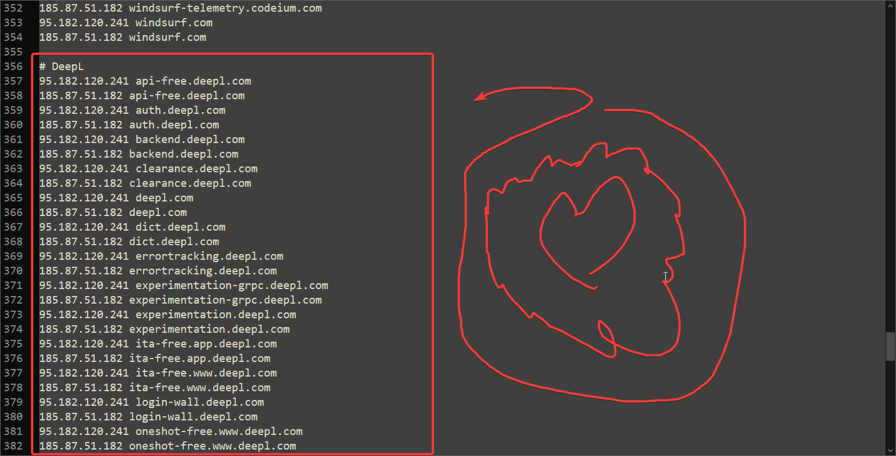

# 🛠️ Основные методы обхода

Здесь собраны общие инструкции. Если в гайде по конкретному сайту написано "используйте Zapret" или "поправьте Hosts" — инструкции ищем тута

---

## ⚡ Метод 1: Zapret (Windows)
Самый мощный способ. Он обманывает фильтры провайдера.

1. **Где взять:** [Скачиваем актуальную версию с GitHub](https://github.com/Flowseal/zapret-discord-youtube)
2. **Как настроить:** Создаём новую папку на рабочем столе, или где душа пожелает, или если имеется "винрар" распоковываем архив и вместе с этим создаётся папка с названием архива по нажатию на ПКМ (правая кнопка миши)

Далее в самом папке с Zapret'om открываем папку **"lists"**
И далее открываем текстовый документ **"list-general.txt"** и туда добавляем доменв как на скриншоте ниже

После мы сохраняем текстовый документ и возвращаемся в самое начало.
Выбираем из списка любую стратегию, они имеют расширение .bat

После чего у нас открывается коснсоль, её можно свернуть, **но не закрывать!!!**

Ну вот и всё!! После каждого запуска системы придётся запускать нащ .bat файл, но это можно автоматизировать. Переходим к следующему шагу

3. (Опционально) **Как автоматизировать запуск Zapret?**

В самой главной папке открываем **service.bat** Там выбираем 1 - install services. Далее выбираем любую стратегию, которая вам приглянулась, у меня, к примеру, 11-ая

После чего выходим из консоли. Теперь нам не нужно будет каждый раз запускать эту наглую стратегию ( •̀ ω •́ )✧

**Заключение**
Это был метод через zapret, надеюсь всё всем понятно **:P**

---

## 📝 Метод 2: Редактирование файла Hosts
Если нужно просто "направить" компьютер на правильную сторону (Во, как я круто написал)

Заходим в проводник и переходим по пути C:\Windows\System32\drivers\etc (или копируем сам путь и вставляем в проводнике). Мы наблюдаем файл "Hosts" Его открываем блокнотом или другим текстовым редактором **от имени администратора** и добавляем наши айпишки по примеру из скриншота:

После чего сохраняем... И на этом всё!!!