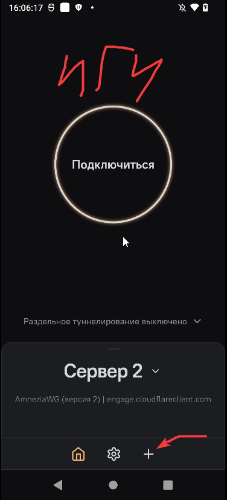
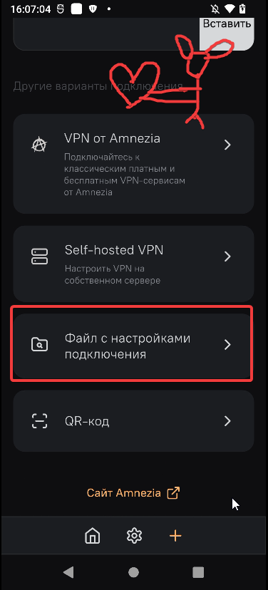
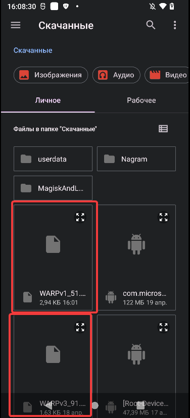
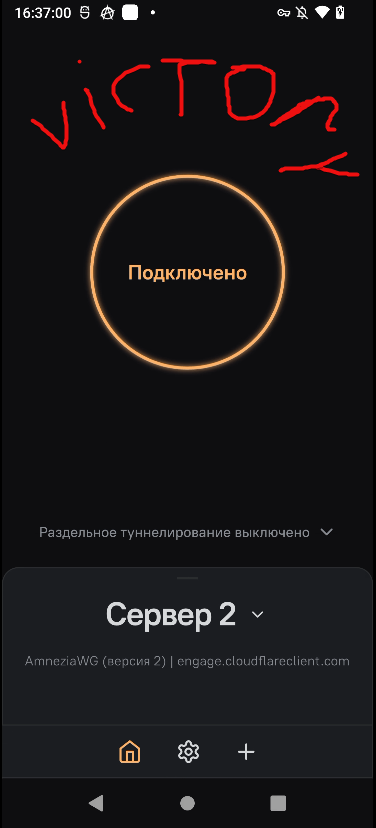

Всем приветик OwO Сегодня я напишу про простенькое приложение по функционалу и оно довольно популярную. Amnezia VPN.

Если что в низу инструкции есть раздел "**дополнительная информация**" Может быть там будет что-то полезное для вас.

❗❗Если у вас не работает приложение, то советую внизу прочитать раздел "**Решение проблем**" Если после этого не получилось, то можно написать мне в Телеграме, чтобы там уже разобрались<3 (не даю гарантий) ❗❗

---

## 0.0 Подготовка: Генерация WARP-конфигов

Прежде чем настраивать программы, нам нужно получить сами warp-конфиги. Советую скачать сразу 2-3 штуки на всякий =Р

Где взять конфиги:
1. **Самый простой вариант:** [Переходим по ссылке на Warp-Generator](https://warp-generator.github.io/), выбираем в окошке "AmneziaWG" любой из 3-х вариантов, файл скачается на устройство.
2. **Альтернативный скрипт:** [Генератор от ImMALWARE](https://github.com/ImMALWARE/bash-warp-generator) там описан сам процесс получения warp-конфигов
3. **Через Телеграм:** Бот `@warp_generator_bot` — тоже выдаёт конфиги, думаю разберётесь

Вот теперь, когда файлы у нас, переходим к установке!

---

<b>О приложении (описание взято с 4pda)</b>

Amnezia VPN — это универсальное приложение для запуска VPN через готовые конфигурации (ключи).

Amnezia VPN простое и бесплатное приложение с открытым исходным кодом для создания личного VPN а также для запуска self-hosted Vpn с высоким уровнем приватности.

Amnezia это не только VPN. С помощью клиента можно в два клика создать свой DNS-сервер, безопасное файловое хранилище и развернуть сайт на WordPress в сети Tor.

Поддерживает современные протоколы для обхода блокировок: OpenVPN и WireGuard. AmneziaWG с защитой от распознавания трафика.

1. Раздельное туннелирование.
2. Импорт и настройки, бэкап.
3. Не сохраняет логи.
4. Протоколы: OpenVPN, WireGuard, AmneziaWG.
5. Шифрование.
6. Настройки DNS.
7. Безопасное хранилище файлов.
8. SFTP сервер для надежной и безопасной передачи файлов через защищённое соединение.
9. Поддержка платформ: Android, Windows, Linux, MacOS, IOS.
10. Функция обфускации, обход запретов на Vpn и ограничения Vpn. Сканирует неблокируемые порты и использует их для Vpn трафика или маскирует Vpn трафик. Что делает Vpn трафик похожим на обычный интернет трафик, и предоставляет пользователям возможность обходить запреты на Vpn.

## 1.0 Android

### Подготовка

Скачиваем само приложение и устанавливаем.

[Play market](https://play.google.com/store/apps/details?id=org.amnezia.vpn&hl=ru&pli=1)

[GitHub](https://github.com/amnezia-vpn/amnezia-client/releases/tag/4.8.14.5)

[4pda](https://4pda.to/forum/index.php?showtopic=1078416) (Без ВПНа не впустит)

После установки приложения и захода мы видим симпатичное внешне приложение. Нам нужно добавить WARP конфиг для работы нашего VPN.

---

### Настройка

После установки приложения заходим и мы видим симпатичное внешне приложение. Нам нужно добавить WARP конфиг для работы нашего VPN.

1. Переходим по [**ссылке**](https://warp-generator.github.io/) на сайт.

2. Нажимаем на любой вариант на сайте, чтобы установить сам конфиг.

(Советую сгенерировать сразу 3 штуки, чтобы не бегать лишний раз на сайт. Такая форма заботы у меня)

У вас скачается сам конфиг WARP. Если у вас вдруг перестанет работать конфиг, то всегда можно будет сгенерировать второй, третий и так далее.

После генерации конфига возвращаемся в наше приложение и делаем всё по шагам

1. Нажимаем на плюсик, как на скриншоте

  
   
  <em></em>

2. Далее нажимаем на **"Файл с настройками подключения"**

  
   
  <em></em>

3. Выбираем наш конфиг

  
   
  <em></em>

---

### Запуск и проверка
 Возвращаемся в главное меню приложения и подключаемся. Victory!! На этом всё :3

  
   
  <em></em>

---

### Дополнительная информация

В приложении присутствует **"Раздельное туннелирование сайтов"** на сегодняшний день очень нужная функция. Она позволяет настроить сайты или айпи, которые должны или не должны открываться через ВПН. Удобно для разных сайтов.

Ищите данный пункт в Настройках - Соединение - Раздельное туннелирование сайтов.

[**Другой генератор конфигов WARPъ**](https://github.com/ImMALWARE/bash-warp-generator) Просто перейдите по ссылке и сделайте там всё по инструкции. Это в случае, если первый сайт с генератором WARP не работает и прочая муть ✌✌

[**Видео-гайд по использованию AmneziaVPN**](https://www.youtube.com/watch?v=Cfo5ZjSQgzY&rco=1). Простенькое видео, где показано как пользоваться приложением.

---

### Решение проблем
Тут я распишу возможные решения, если приложение не хочет работать (*/ω＼*)

**Не подключается впн?** Есть несколько решений, которые я могу предложить:

1. Поменять или выключить "Персональный DNS-сервер" (если не знаете как поменять, то смотрим в инете). Я могу посоветовать два dns'a: one.one.one.one или dns.google.

2. Попробуйте использовать другой конфиг WARP, обычно это помогает

3. Бредовое... но можно просто пару раз запустить\отключить наш конфиг и тот вполне с высокой вероятностью запуститься и будем фунционировать><

4. Сменить обход блокировок: думаю до такого не дрйдёт, но если вдруг ничего не помогает, то проще найти другой способ обхода тупо-блокировок (☞ﾟヮﾟ)☞ ☜(ﾟヮﾟ☜)

Желаю всем удобного интернета =.=

---