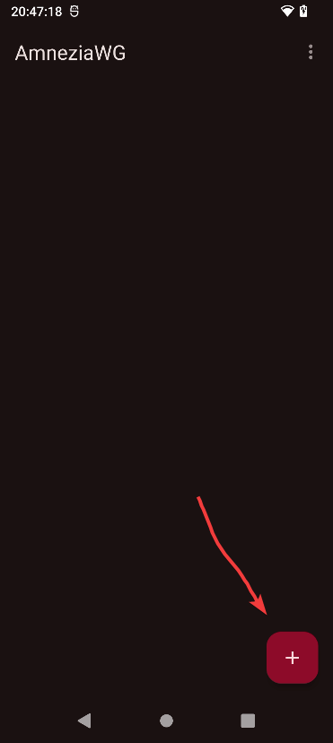
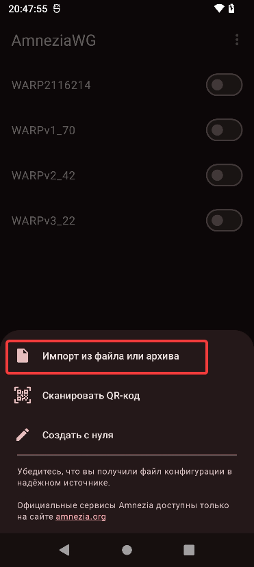

Всем приветик! Тут будет инструкция по тому где и минимальное использование AmneziaWG для андроида и виндовс :3

<b>Что такое AmneziaWG? Описание с официального сайта</b>

AmneziaWG — это форк WireGuard-Go, который унаследовал простоту архитектуры и высокую производительность оригинала, но избавился от характерных сетевых «подписей», благодаря которым WireGuard легко определяется системами DPI (Deep Packet Inspection). 

Версия 1.5 вывела маскировку на новый уровень: трафик стал маскироваться под наиболее распространённые UDP‑протоколы (QUIC, DNS и др.).

Версия 2.0 развивает этот подход до «мимикрии»: трафик становится ещё менее узнаваемым для DPI не только в момент подключения, но и во время передачи данных за счёт постоянно меняющихся заголовков и размеров пакетов данных. В результате снижается вероятность распознавания VPN-трафика по характерным признакам и усложняется его эвристический анализ.

Прародитель AmneziaWG — WireGuard зарекомендовал себя как быстрый и надежный VPN-протокол благодаря компактному коду и высокой эффективности. Однако его фиксированные заголовки пакетов и предсказуемые размеры образуют легко узнаваемую сигнатуру. DPI‑системы без труда идентифицируют такие пакеты и могут мгновенно разрывать соединение — серьёзная проблема в странах с интернет-цензурой.

AmneziaWG 1.5 решал эту проблему через многоуровневую обфускацию на транспортном уровне: модифицировал заголовки пакетов, рандомизировал размеры handshake-сообщений и позволял маскировать трафик под популярные UDP‑протоколы.

AmneziaWG 2.0 ещё больше усиливает обфускацию: использует динамические диапазоны для заголовков вместо статических, добавляет случайные байты информации к специальным Wireguard-пакетам, а также расширяет сигнатурные CPS-пакеты перед рукопожатием, чтобы ещё более правдоподобно имитировать UDP-протоколы. При этом базовое криптографическое ядро WireGuard остается неизменным, сохраняя его производительность и безопасность.

## 0.0 Подготовка: Генерация WARP-конфигов

Прежде чем настраивать программы, нам нужно получить сами warp-конфиги. Советую скачать сразу 2-3 штуки на всякий =Р

Где взять конфиги:
1. **Самый простой вариант:** [Переходим по ссылке на Warp-Generator](https://warp-generator.github.io/), выбираем в окошке "AmneziaWG" любой из 3-х вариантов, файл скачается на устройство.
2. **Альтернативный скрипт:** [Генератор от ImMALWARE](https://github.com/ImMALWARE/bash-warp-generator) там описан сам процесс получения warp-конфигов
3. **Через Телеграм:** Бот `@warp_generator_bot` — тоже выдаёт конфиги, думаю разберётесь

Вот теперь, когда файлы у нас, переходим к установке!

---

## 1.0 Windows

Есть видео-гайд
[Видео на ютубе с гайдом по AmneziaWG но для виндовс](https://www.youtube.com/watch?v=wTHaYNEsAOs&rco=1) (гайд не мой)

### Скачивание и установка

Скачиваем [**AmneziaWG**](https://github.com/amnezia-vpn/amneziawg-windows-client) и устанавливаем <3

### Настройка/Использование

После установки мы заходим в программу и снизу нажимаем на "Добавить туннель" и в проводнике выбираем наш WARP-конфиг, после чего подключаем VPN и проверяем. Сразу уточню, если сайты вовсе перестали загружаться, то попробуйте по новой включить этот же конфиг, или же сгенерируйте новый. Благодарю за чтение ~

---

## 1.1 Android

Если у вас будут проблемы, то можно посмотреть раздел **"решения проблем"**, возможно там найдутся решения.

### Подготовка и установка

Скачиваем и устанавливаем наше приложение. Есть несколько мест, где можно скачать программу

[**Google play**](https://play.google.com/store/apps/details?id=org.amnezia.awg&hl=ru)

[**4pda**](https://4pda.to/forum/index.php?showtopic=1091232) (требуется другой ВПН чтобы войти на сайт)

[**Github**](https://github.com/amnezia-vpn/amneziawg-android)

### Настройка и использование

Программка очень маленькая, так что тут совсем кратенько. Нажимаем на плюс, затем выбираем "импорт из файла" и там уже выбираем наш скачанный конфиг

  
   
  <em></em>

  
   
  <em></em>

### Запуск и проверка
Ну вот мы на финишной прямой! После добавления конфига в наше приложение, просто запускаем наш конфиг в главном меню и можем тестировать наши сайты\приложения :Р

---

### Решения проблем
Тут я распишу возможные решения, если приложение не хочет работать (*/ω＼*)

**Не подключается впн?** Есть несколько решений, которые я могу предложить:

1. Поменять или выключить "Персональный DNS-сервер" (если не знаете как поменять, то смотрим в инете). Я могу посоветовать два dns'a: one.one.one.one или dns.google.

2. Попробуйте использовать другой конфиг WARP, обычно это помогает

3. Бредовое... но можно просто пару раз запустить\отключить наш конфиг и тот вполне с высокой вероятностью запуститься и будем фунционировать><

4. Сменить обход блокировок: думаю до такого не дрйдёт, но если вдруг ничего не помогает, то проще найти другой способ обхода тупо-блокировок (☞ﾟヮﾟ)☞ ☜(ﾟヮﾟ☜)

---