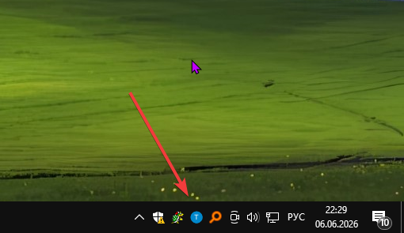
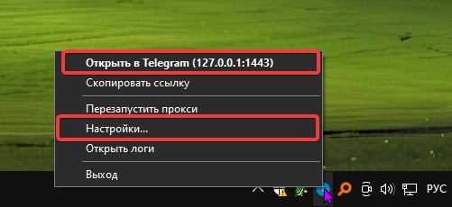
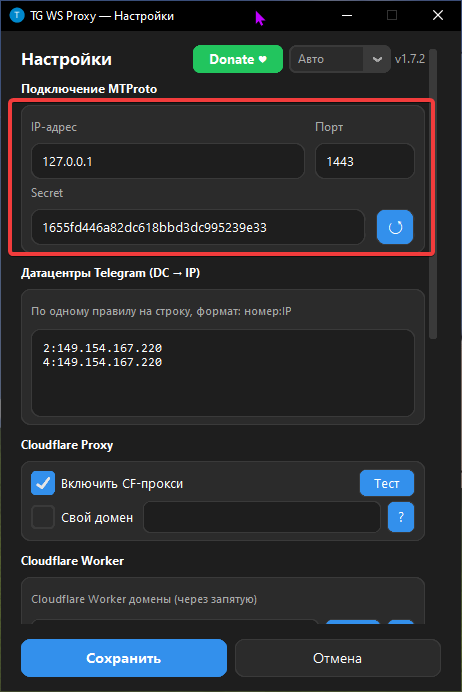
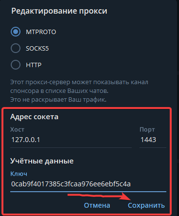
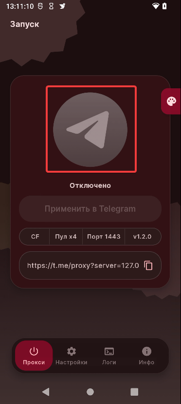
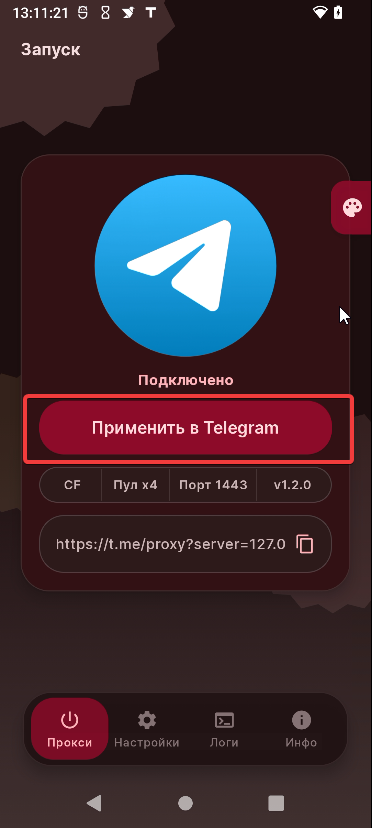
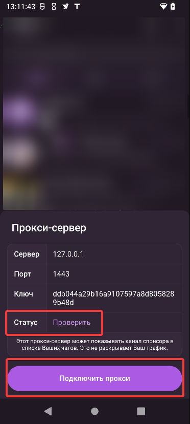
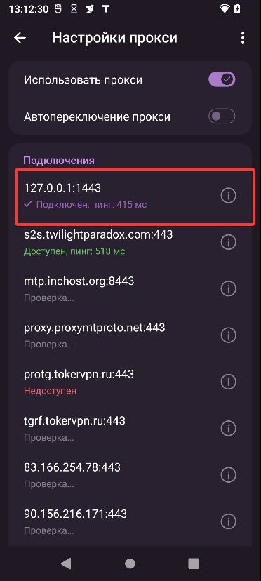
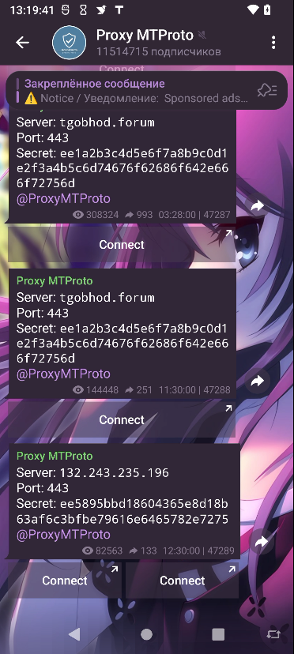
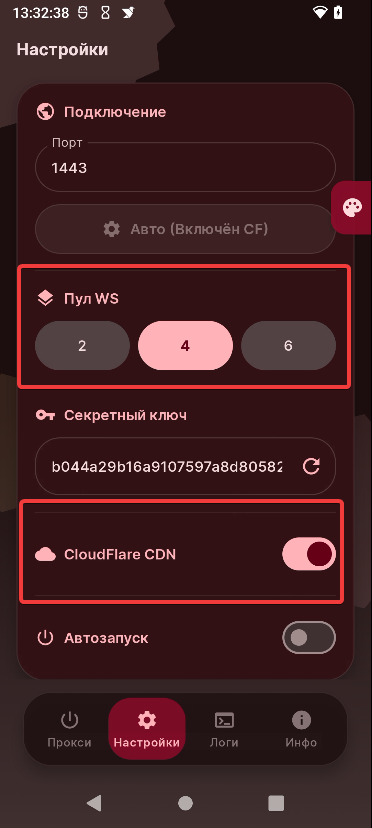

Всем приветик! Это простенькая инструкция. Здесь написано где скачать программу и как её "использовать". 

Уточню про Linux-юзеров: Я вам тут не расписал как нужно действовать, потому что... Ну не сильно желаю виртуалку качать и настраивать, поэтому просто оставлю ссылку на инструкция от самого создателя проги, также можете ориентироваться по инструкции, если действия будут похоже. Спасибо за понимание **<3**

<b>Что за TG WS Proxy? (Описание с репозитория автора)</b>

TG WS Proxy это локальный MTProto-прокси для Telegram Desktop, который ускоряет работу Telegram, перенаправляя трафик через WebSocket-соединения. Данные передаются в том же зашифрованном виде, а для работы не нужны сторонние серверы.

## 1.0 Windows

## Подготовка

Устанавливаем программу по этой [**ссылке**](https://github.com/Flowseal/tg-ws-proxy)

Для Linux пользователей эта программа тоже есть, узнать о том как установить можно также у автора в репозитории. Просто перейдите по [**ссылке**](https://github.com/Flowseal/tg-ws-proxy/blob/main/docs/README.linux.md) и установите из его инструкции

Мелкая справка: Там же в репозитории можно почитать подробнее о програмке, ну и узнать ответы на возможные вопросы

## Настройка/Использование

После скачивания exe файла просто переносим его на рабочий стол, либо куда вам удобнее будет и открываем его, для этого в трее находим иконку проги и кликаем по ней правой кнопкой мыши

Вот, я отметил два пункта, это "настройки" там можно будет настроить программу, и отметил "открыть в ТГ" по нажатию должен который должен перекидывать в ТГ

Если же не можете открыть через ТГ, то можно вручную это добавить. Заходим в "настройки" программы.

Я отметил, что нам нужно, это нужно для Телеграма. 

Открываем ТГ и переходим в: Настройки -> Продвинутые настройки -> Тип соединение. Ну и собственно мы попадаем в настройки прокси, после вручную пишем данные

Обязательно выбираем "MTPROTO", иначе никак, после сохраняем прокси и всё должно будет заработать

## Дополнительно

Программу можно добавить в автозапуск, для этого в настройках программы в самом внизу включаем автозапуск. (¬_¬ )

## 1.1 android

Приветик всем✌ На сегодня у нас будет решения для обхода блокировки исключительно для Телеграма. Это будет реализовано при использовании приложения, который создаёт локальный прокси.

Также оставлю ссылки, где можно найти прокси для ТГ, это если у вас приложение не будет работать должным образом или по иным обстоятельствам.

**Если у вас не сработает способ, то советую просмотреть раздел "решения проблем", возможно оно поможет**

Ещё имеется [видео-инструкция по установке и использованию **TG WS Proxy Android**](https://www.youtube.com/watch?v=RP4RwyEHpwc&rco=1)

<b>Описание приложения (описание взято с Github'a автора)</b>

**TG WS Proxy Android** — это локальный **MTProto-прокси** для Telegram на Android. Приложение помогает частично решать проблемы и в ряде сценариев ускоряет работу мессенджера, перенаправляя трафик через защищённые CloudFlare WebSocket-соединения или напрямую к датацентрам Telegram.

## Подготовка и установка

Скачиваем и устанавливаем наше приложение: [**Github**](https://github.com/amurcanov/tg-ws-proxy-android/releases/tag/v1.2.0)

## Настройка и использование \ Запуск и проверка

Заходим в наше приложение и нажимаем на центральную кнопку

  
   
  <em></em>

Затем, после включения, нажимаем на "**Применить в Telegram**", нас перебросит в ТГ

  
   
  <em></em>

Подключаем прокси (по желанию можно проверить статус прокси-сервера, а точнее его пинг).

  
   
  <em></em>

Ну вот и всё! В **настройках прокси** можем наблюдать такую картину:

  
   
  <em></em>

## Прокси в ТГК!!!

Если вам не нравится пользоваться приложениями на подобии таких, то можно найти прокси в телеграм-каналах или в интернете. Один из самых популярных каналов про прокси является [**@ProxyMTProto**](t.me/ProxyMTProto)

Просто переходите по ссылке и там выбирайте любой из прокси (они часто публикуются)

  
   
  <em></em>

>Нажимаем на "Connect" и подключаем прокси

## Решения проблем
Если у вас имеются проблемы с использованием приложения, то данный раздел может вам помочь ψ(._. )>

1. Возвращаемся в приложение и переходим во вкладку "**Настройки**"
 Затем изменяем значение "**Пул WG**" на любое другое значение и проверяем наш прокси. Если даже так не помогло, то пробуем выключить "**CloudFlare CDN**"" и также проверяем.

  
   
  <em></em>

