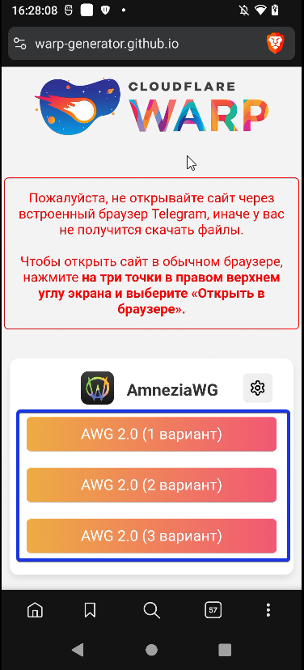
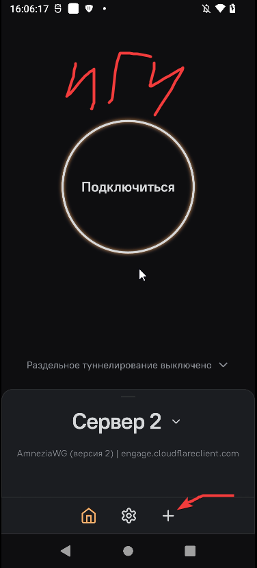
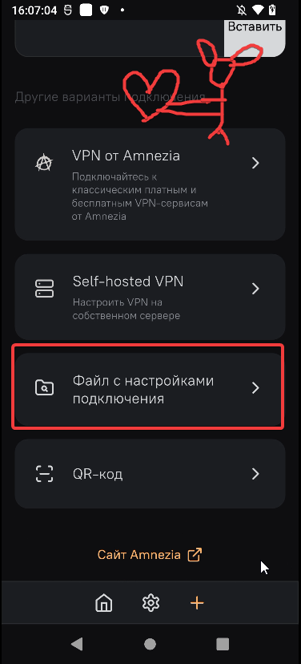
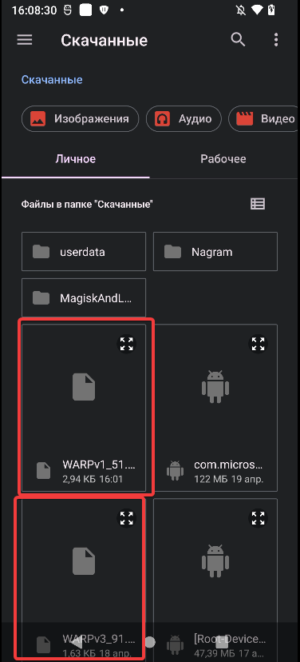
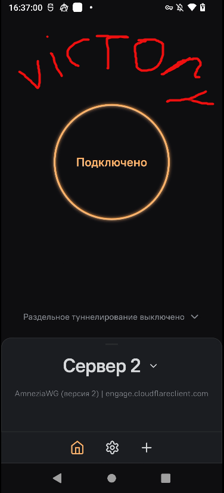

Всем приветик OwO Сегодня я напишу про простенькое приложение по функционалу и про довольно популярную. Amnezia VPN.

Расскажу краткое что такое Amnezia, где найти конфиги для приложение, как использовать и дополнительное.

**Что такое Amnezia VPN?** (Ответ от Gemini):

Amnezia VPN — это универсальное приложение для запуска VPN через готовые конфигурации (ключи).

* Функция: Вы вставляете в программу ключ (код или QR-код), и она создает защищенное соединение.

* Зачем это нужно: Программа поддерживает протоколы, которые маскируют трафик. Это позволяет обходить блокировки, которые справляются с обычными VPN.

* Удобство: Не нужно ничего настраивать вручную. Приложение само считывает параметры из ключа и выбирает нужный метод подключения.

* Назначение: Используется как надежный клиент для доступа к заблокированным ресурсам, когда стандартные методы не работают.

При желании вы сможете сами почитать более подробно про программу, или спросить более опытных людей (я не подхожу под роль опытного).

## WARP конфиги

Для начала нам нужно скачать WARP конфиг для нашего приложения. Без него не будет работать сам ВПН. 

1. Переходим по [**ссылке**](https://warp-generator.github.io/) на сайт

2. Нажимаем на любой вариант на сайте.

У вас скачается сам конфиг WARP. Если у вас вдруг перестанет работать конфиг, то всегда можно будет сгенерировать второй, третий и так далее.

---

Переходим к установке приложения **><**

## Установка

Скачиваем само приложение и устанавливаем.
 
[Play market](https://play.google.com/store/apps/details?id=org.amnezia.vpn&hl=ru&pli=1)
 
[GitHub](https://github.com/amnezia-vpn/amnezia-client/releases/tag/4.8.14.5)
 
[4pda](https://4pda.to/forum/index.php?showtopic=1078416) (Без ВПНа не впустит)

## Использование

После установки приложения и захода мы видим симпатичное внешне приложение. Нам нужно добавить WARP конфиг для работы нашего VPN.

1. Нажимаем на плюсик, как на скриншоте

2. Далее нажимаем на **"Файл с настройками подключения"**

3. Выбираем наш конфиг

4. Возвращаемся в главное меню приложения и подключаемся. Victory!! На этом всё :3

## Дополнительное

Также в приложении присутствует **"Раздельное туннелирование сайтов"** на сегодняшний день очень нужная функция. Она позволяет настроить сайты или айпи, которые должны или не должны открываться через ВПН. Удобно для разных сайтов.

Ищите данный пункт в Настройках - Соединение - Раздельное туннелирование сайтов.

## Заключение

Приложение очень простенькое и удобное, как по мне, есть минус, что не отображается скорость передачи трафика и отдачи (как в том же Portal wg), но думаю не велика потеря.

Если у вас не будет работать что-то, то можно попробовать поменять DNS на устройстве, или сменить конфигурацию. Лично у меня работает, поэтому инструкция и есть :Р

Желаю всем удобного интернета =.=