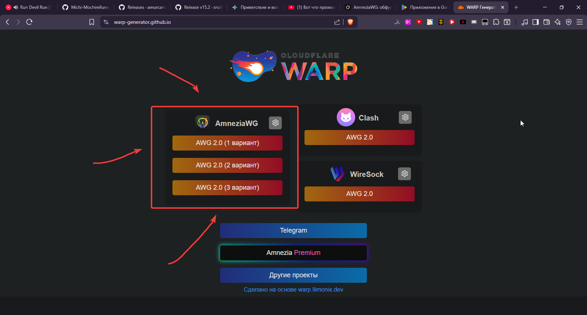
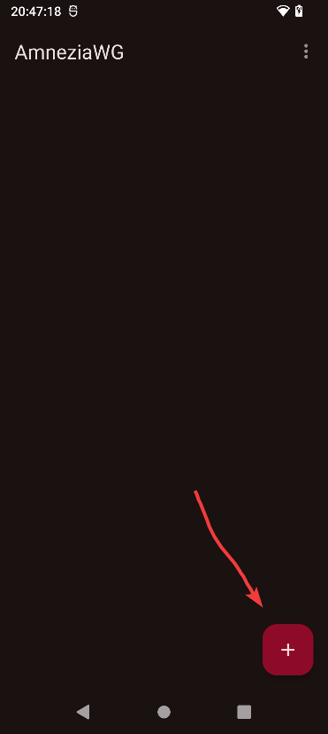
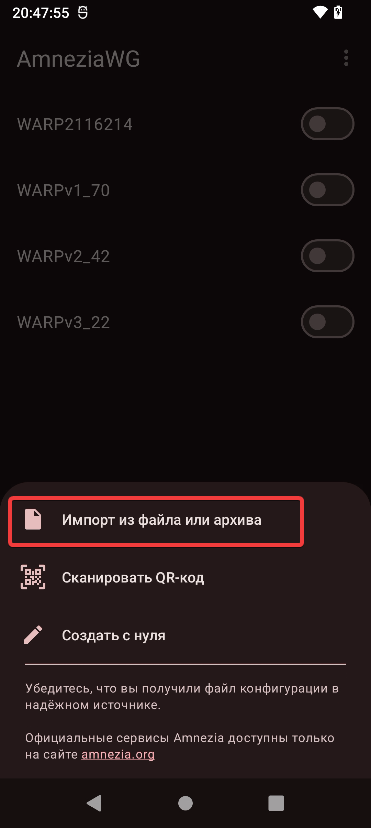

Всем приветик! Эта очередная инструкция из разряда "сгенерируй WARP"... в общем ничего нового. Я уже писал про amneziaVPN, portalwg и прочая эта хрень, которые работают на warp конфигах, оно удобно, потому что можно просто на сайте сгенерировать и получить рабочий ВПН, по факту все эти инструкции однотипные, только приложения разные и имеют где-то больше функций или меньше, но всё же я буду продолжать про такие приложения писать, тем-более наш гость AmneziaWG хорошо работает, точнее более стабильно (пишу исключительно за себя).

❗❗Если у вас не работает приложение, то советую внизу прочитать раздел "**Решение проблем**" Если после этого не получилось, то можно написать мне в Телеграме, чтобы там уже разобрались<3 (не даю гарантий) ❗❗

Если что в самом низу инструкции есть раздел "**дополнительная информация**" Может быть там будет что-то полезное для вас

## О приложении
Что такое AmneziaWG? (Описание с [**официального сайта**](https://docs.amnezia.org/ru/documentation/amnezia-wg/))

AmneziaWG — это форк WireGuard-Go, который унаследовал простоту архитектуры и высокую производительность оригинала, но избавился от характерных сетевых «подписей», благодаря которым WireGuard легко определяется системами DPI (Deep Packet Inspection). 

Версия 1.5 вывела маскировку на новый уровень: трафик стал маскироваться под наиболее распространённые UDP‑протоколы (QUIC, DNS и др.).

Версия 2.0 развивает этот подход до «мимикрии»: трафик становится ещё менее узнаваемым для DPI не только в момент подключения, но и во время передачи данных за счёт постоянно меняющихся заголовков и размеров пакетов данных. В результате снижается вероятность распознавания VPN-трафика по характерным признакам и усложняется его эвристический анализ.

Прародитель AmneziaWG — WireGuard зарекомендовал себя как быстрый и надежный VPN-протокол благодаря компактному коду и высокой эффективности. Однако его фиксированные заголовки пакетов и предсказуемые размеры образуют легко узнаваемую сигнатуру. DPI‑системы без труда идентифицируют такие пакеты и могут мгновенно разрывать соединение — серьёзная проблема в странах с интернет-цензурой.

AmneziaWG 1.5 решал эту проблему через многоуровневую обфускацию на транспортном уровне: модифицировал заголовки пакетов, рандомизировал размеры handshake-сообщений и позволял маскировать трафик под популярные UDP‑протоколы.

AmneziaWG 2.0 ещё больше усиливает обфускацию: использует динамические диапазоны для заголовков вместо статических, добавляет случайные байты информации к специальным Wireguard-пакетам, а также расширяет сигнатурные CPS-пакеты перед рукопожатием, чтобы ещё более правдоподобно имитировать UDP-протоколы. При этом базовое криптографическое ядро WireGuard остается неизменным, сохраняя его производительность и безопасность.

## Подготовка

Скачиваем и устанавливаем наше приложение. Есть несколько мест, где можно скачать приложение

[**Google play**](https://play.google.com/store/apps/details?id=org.amnezia.awg&hl=ru)

[**4pda**](https://4pda.to/forum/index.php?showtopic=1091232) (требуется другой ВПН чтобы войти на сайт)

[**Github**](https://github.com/amnezia-vpn/amneziawg-android)

(К слову! На 4пда есть версия приложения с встроенным генератором конфигов WARP. Если хотите, то скачайте и опробуйте его)

Также нам требуется сгенерировать конфиги WARP. [Переходим по ссылке](https://warp-generator.github.io/) (Если первый сайт не работает, то посмотрите раздел "**Дополнительная информация**", там я оставил ссылку на другой сайт, где конфиг можно также сгенерировать).

Тут выбираем любой вариант и на наше устройство скачается конфиг (советую скачать сразу 3 штуки, чтобы потом не бегать туда-сюда).

## Настройка

Программка очень маленькая, так что тут совсем кратенько. Нажимаем на плюс, затем выбираем "импорт из файла" и там уже выбираем наш конфиг скачанный ранее

## Запуск и проверка
Ну вот мы на финишной прямой! После добавления конфига в наше приложение, просто запускаем наш конфиг в главном меню и можем тестировать наши сайты\приложения :Р

## Решение проблем
Тут я распишу возможные решения, если приложение не хочет работать (*/ω＼*)

**Не подключается впн?** Есть несколько решений, которые я могу предложить:

1. Поменять или выключить "Персональный DNS-сервер" (если не знаете как поменять, то смотрим в инете). Я могу посоветовать два dns'a: one.one.one.one или dns.google.

2. Попробуйте использовать другой конфиг WARP, обычно это помогает

3. Бредовое... но можно просто пару раз запустить\отключить наш конфиг и тот вполне с высокой вероятностью запуститься и будем фунционировать><

4. Сменить обход блокировок: думаю до такого не дрйдёт, но если вдруг ничего не помогает, то проще найти другой способ обхода тупо-блокировок (☞ﾟヮﾟ)☞ ☜(ﾟヮﾟ☜)

## Дополнительная информация

Тут я распишу что-то дополнительное

[Видео на ютубе с гайдом по AmneziaWG но для виндовс](https://www.youtube.com/watch?v=wTHaYNEsAOs&rco=1) (гайд не мой)

[**Другой генератор конфигов WARPъ**](https://github.com/ImMALWARE/bash-warp-generator) Просто перейдите по ссылке и сделайте там всё по инструкции. Это в случае, если первый сайт с генератором WARP не работает и прочая муть ✌✌