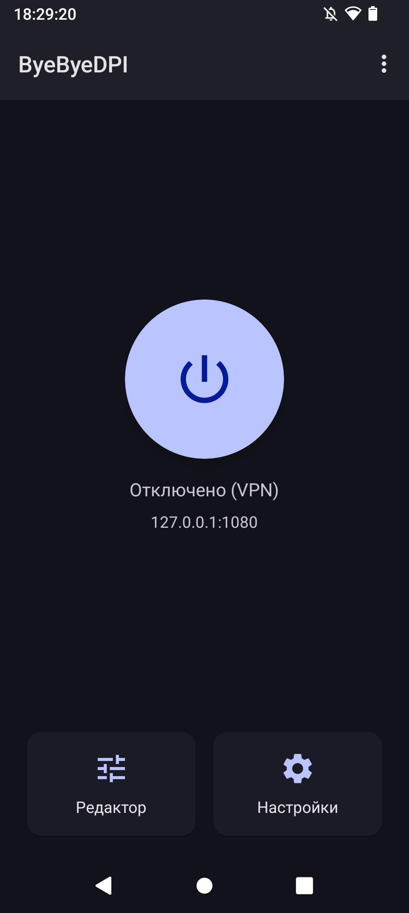
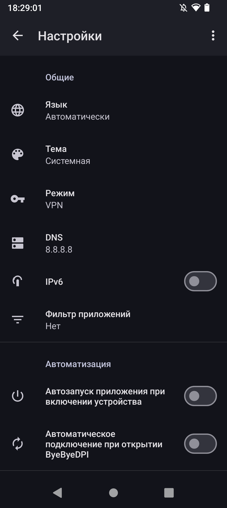
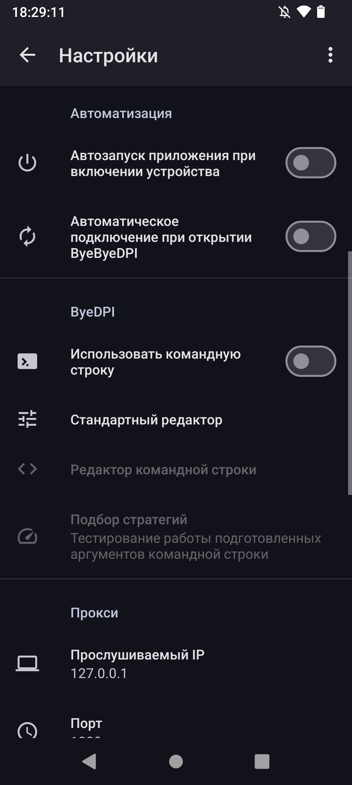
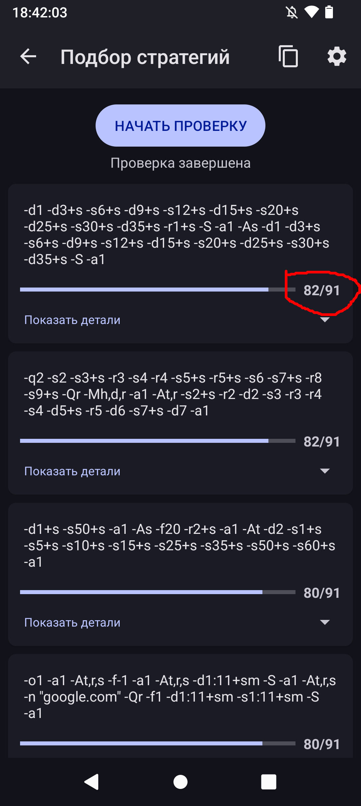

Всем приветик! (≧∇≦)ﾉ

>Что такое ByeByeDPI?

ByeByeDPI — это приложение для обхода DPI-блокировок, которое использует локальный VPN-интерфейс для модификации трафика без подключения к внешнему VPN-серверу. 
 
(Спасибо ChatGPT, а то я не имею объяснять и писать).

Теперь можем начать!

1. [Устанавливаем приложение](https://github.com/romanvht/ByeByeDPI/releases) затем открываем его.

2. Мы попадаем в приложение. Уже можно включить и попробовать определенные сервисы и сайты.

Если не работает, то можно кое-что поменять, я покажу, а вы уже решите нужно ли вам или нет. На этом основная часть инструкции окончилась.
 
Если вы решили остаться, то продолжим :)

3. Переходим в настройки приложения

4. Включаем "IPv6" и "Использовать комадную строку", после переходим в **"Подбор стратегий"**

5. Нажимаем на "начать проверку" и выбираем стратегию с наибольшим значением (чем ближе к максимуму, тем лучше). В данном примере максимум — 91, но у вас он может отличаться.

Как только вы выбили "лучшую стратегию" нажимаем по ней же и появится окошко, выбираем "применить"

6. (опционально) 
справа сверху есть иконка шестерни, переходим туда. Там выбираем "Списки доменов"

Там мы может выбрать уже заготовленные списки доменов, а можем добавить свои. Нажимаем на "добавить список" и там заполняете по вашему желанию.

### **Заключение:**

Приложение не идеальное, геоблоки со стороны самих сайтов он не обходит, Телеграм он не чинит, но так как продукт бесплатный, то я на эти минусы не заглядываюсь, в основном он работает хорошо. А теперь я отвечу на возможные вопросы. 

### **Вопросы и ответы:**

>Я сделал основную часть инструкции, но сайты/приложения не работают. Что делать?

Советую сделать вторую часть инструкции... Либо в настройках включить/отключить IPv6 и сменить dns на "1.1.1.1". На крайняк отключить/поменять dns в самих настройках телефона. А так мне посоветовать нечего (～￣▽￣)～

>Я сделала всё по инструкции, полностью, но сайты/приложения не работают

ByeByeDPI не идеальный, он может просто не обходить некоторые сайты и приложения, но есть пару методов, который могут помочь:

1. Добавить домена тех или иных сайтов в приложении и снова подобрать стратегию

2. В настройках ByeByeDPI изменить dns на "1.1.1.1"

3. Отключить или включить IPv6

4. Отключить/поменять dns в самих настройках телефона

