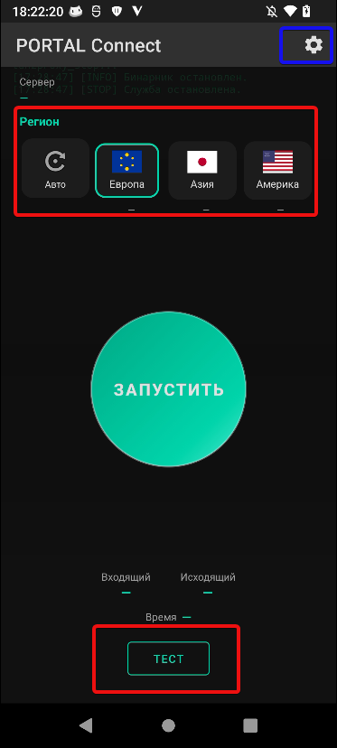
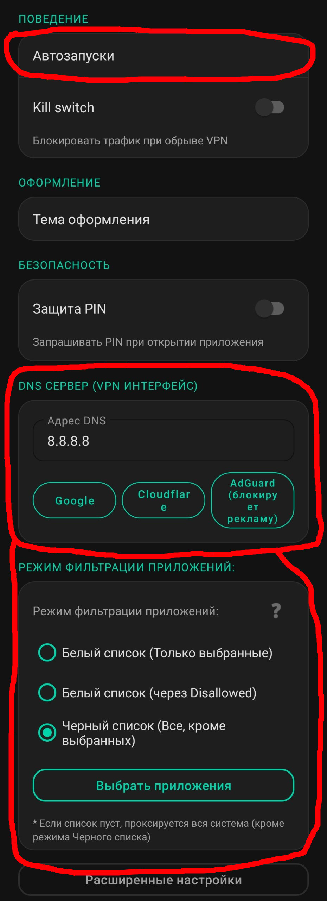

Hi everyone!!! 

Сегодня я расскажу про наше приложение и как им пользоваться **<3**

## Что такое Portal Connect? (Описание от Grok'a)

Это VPN-клиент, который создаёт на телефоне защищённый туннель и направляет весь (или выбранный) интернет-трафик через прокси-сервера Opera.
Он появился как альтернатива, когда другие популярные решения (Portal WG, Portal WG Lite, Cloudflare WARP, обычные WireGuard и т.д.) перестают работать из-за жёстких блокировок провайдеров или Роскомнадзора.

При желании вы всегда можете более подробно почитать информацию про это приложение, или же спросить у опытного человека❤

И ещё!!! У разработчика этого приложения есть свой [ТГК](t.me/STR_BYPASS), где выходят обновления программ и где их удобно устанавливать!!!

## Установка

[**Скачиваем**](https://sourceforge.net/projects/cyberportal/files/PortalConnect/) приложение и открываем его

Мы попадаем в это чудо-приложение.

## Использование

- Выбираем наш желаемый регион и нажимаем "Запустить" после чего у нас начнётся запуск ВПНа (может занять некоторое время) затем можете проверять ваши сайты/приложения.

- Хочу отметить, что снизу есть кнопочка "Тест" Она... Скорость региона показывает? Вроде так.

Ну и.. на этом всё :/

Далее я напишу дополнительную и уже не самую важную информацию.

## Дополнительное

Дополнительная информация... Касается настроек... Там ничего такого, просто постараюсь объяснить что там есть

* В настройках можно настроить автозапуск. Например автозапуск при обрыве соединения ВПН, или при подключении ВайФай, либо же при загрузке устройства и при открытии приложения.

* Ещё можно изменить адрес DNS, если при подключении происходят проблемы или вовсе не подлючается.

* И наконец... Тут присутсутствует режим фильтрации приложений. Тоесть можно выбрать приложения, которые будут работать с ВПН или наоборот/

