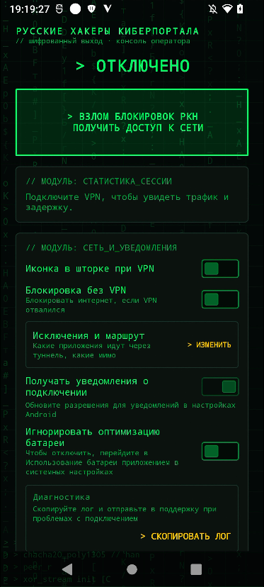
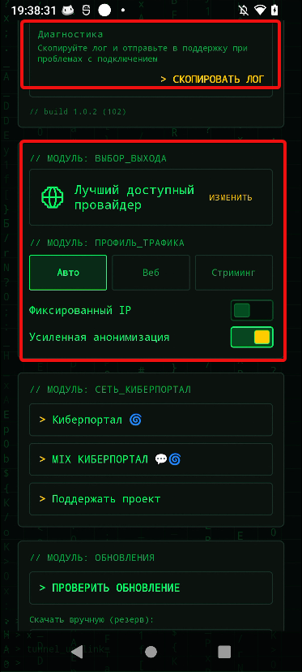

Приветик :|

В данной инструкции (это точно инструкция?) я распишу про приложение, где скачать, как использовать. И что можно сделать если приложение не работает.

## Что такое Portal Tor? (Ответ от Grok'a)

Portal Tor - Это VPN-клиент, который пропускает трафик через сеть Tor (The Onion Router)

Как работает Portal Tor:

Приложение запускает VpnService Android (как и Portal Connect).
Весь трафик (или выбранных приложений) направляется в локальный Tor-клиент, встроенный в приложение.

Tor создаёт цепочку из 3 узлов (луковую маршрутизацию):
Входной узел (Guard)
Средний узел (Relay)
Выходной узел (Exit)

Трафик шифруется несколькими слоями, как луковица. Каждый узел знает только предыдущий и следующий, но не весь путь.
На выходе из сети Tor трафик выходит в обычный интернет уже с другого IP (выходного узла).

Благодаря этому:

Провайдер и Роскомнадзор видят только зашифрованный трафик к первому узлу Tor.
Сайты и сервисы видят IP выходного узла Tor, а не твой реальный.
Очень сложно отследить, кто ты и откуда.

При желании можно более подробно прочитать про приложение в браузере, или спросить у опытного человека, который сможет об'яснить.

И ещё!!! У разработчика этого приложения есть свой [ТГК](t.me/STR_BYPASS), где выходят обновления программ и где их удобно устанавливать!!!

## Установка

[Скачиваем](https://sourceforge.net/projects/cyberportal/files/PORTAL%20TOR/) приложение и для начала открываем его~

## Использование

Нас встречает очень... Хакерское приложение, всё мерцает и прочее.

Нажимаем на "Взлом Блокировок РКН" после некоторого времени (это может быть долго) у нас подключится наш ВПН, это сразу будет заметно. После чего можно проверять наши любимые приложения/сайты.

Обычно этого достаточно. Дальше я кратенько об'ясню что можно сделать если у вас не захочет подключаться ВПН

## Дополнительно

Если у вас всё-таки впн не работает, то можно сделать следующее:

1. Нажимаем на "Изменить" возле "Лучшего провайдера"

Там можно выбрать сам провайдер. В США самое большое количество. Можно просто попробовать повыбирать разных провайдеров.

2. Сменить/отключить DNS на самом телефоне. Может быть удивительно, но dns может повлиять на трафик. Советую настоятельно выключить "Автоматический" режим в настройках dns, он... не сильно нужен. Лучше использовать такие "dns.google, one.one.one.one" Они одни из самых популярных и не российских.

3. Если совсем всё плохо, то лучше выбрать другое приложение для обхода блокировок. Или же отправить лог в поддержку, как показано на скрине.

## Заключение

Приложение... Топорное, это же Тор, он всегда медленный, но главное оно работает. Всем удачки и желаю свободного интернета🤞

