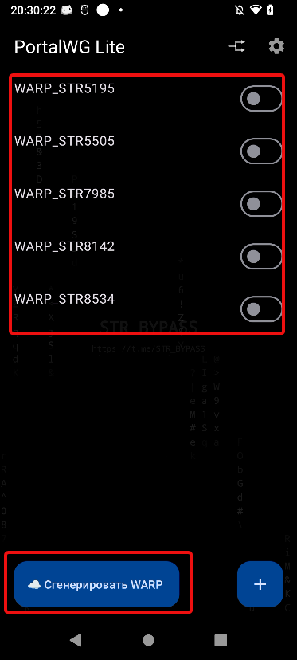
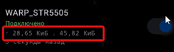

Всем халлоу :O

Сегодня я вам поведую при одно приложение - Portal WG Lite, где его скачать, как использовать, и возможное решение проблем с рабоспособностью.

## Что такое Portal WG Lite?? (Описание от Grok'a)

Это VPN-клиент, построенный на протоколе WireGuard (WG). Главная его «фишка» — удобная и автоматическая работа с Cloudflare WARP (бесплатный сервис Cloudflare, который даёт быстрый и относительно стабильный туннель).

Более подробное описание:

Приложение само генерирует конфигурацию WireGuard для Cloudflare WARP (или позволяет импортировать свою).

Использует стандартный VpnService Android — создаёт защищённый туннель на уровне всей системы.
Трафик шифруется современным и очень быстрым протоколом WireGuard.

Подключается к серверам Cloudflare (или к своим кастомным WireGuard-серверам).
В новых версиях появилась возможность выбора страны для WARP-конфигурации — это большой плюс по сравнению со старыми версиями.

Дополнительно приложение поддерживает:
Импорт любых WireGuard-конфигов (.conf)

Подключение VLESS-подписок (в некоторых версиях)

Split-tunnel (только выбранные приложения)

Автоматическое переподключение при смене сети (Wi-Fi ↔ мобильный интернет)
Хорошую работу на слабом сигнале

От себя: Это как Portal WG, но для старых устройств, он более оптимизированный, но работа как в его старшем братике.

Описание Грока может быть не совсем точным, я не ручаюсь за его слова. Вы всегда можете проверить его слова в интернете, или более подробно ознакомиться с работой приложения :3

И ещё!!! У разработчика этого приложения есть свой [ТГК](t.me/STR_BYPASS), где выходят обновления программ и где их удобно устанавливать!!!

## Установка

[Скачиваем](https://sourceforge.net/projects/cyberportal/files/PortalWG%20Lite/) приложение и открываем его

## Использование

Вот наше приложение!! Обычно достаточно сделать следующее:

1. Нажми на нижнюю кнопку "Сгенерировать варп" спустя некое время у нас сверху появится сам конфиг

2. Включаем тумблер и на этом всё!!

На скриншоте я отметил как это должно будет выглядеть, хочу пристально обратить внимание на эти два покателя. Один из них отвечаем за передачу, а другой за принятие. Они должны быть в нормальых показателей, вот как на скрине показано. Если у одного показателя будет 62 КБ, а у другого, допустим 92 байта (это мало), то наш ВПН не будет работать. Это я отметил... На всякий

Далее я опишу, что делать, если наш ВПН не сильно желает работать (^._.^)

## Дополнительно

Бывает, что приложение... Может хромать (не работать). Предлагаю свои варианты решения проблемы.

1. Перезапустить конфиг. Может показаться удивительным, но пару раз перезапустить конфиг во многих случаях помогает ей "набрать скорости"

2. Если первый вариант не помог, то можно подождать немного и сгенерировать конфиг по новой. Тоже обычно помогает

3. Как я обычно и предлагаю, это сменить DNS на самом телефоне. Рекомендую его вовсе выключить либо использовать dns.google, one.one.one.one

4. Если совсем туго, то лучше поменять приложение

## Заключение (или же мои мысли)

Приложение достаточно удобное, простое в использовании и обычно его достаточно, чтобы пользоваться привычными приложениями. Но, конечно, всегда может произойти непредвиденное. Удачки всем с нормальным провайдером и свободным интернетом 👌

Я просто скопировал всю инструкцию от Portal WG и вставил сюда. Это магия (⓿_⓿)