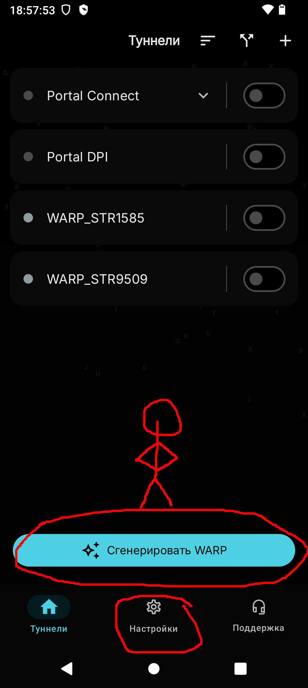
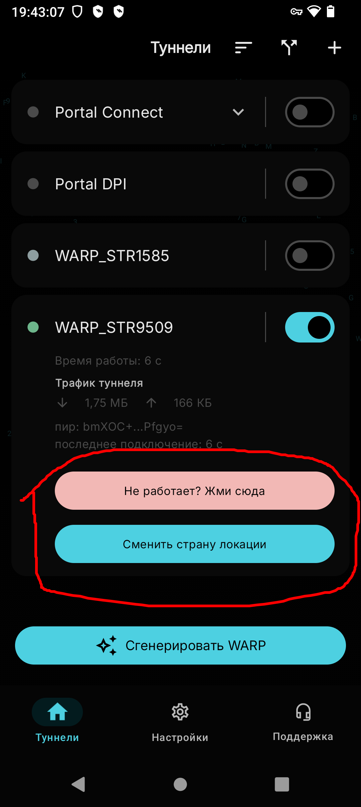

Всех приветствую! С Телеграмом дело интереснее, потому что это меня тоже коснулось, как и многих. Если Инстой и Фейсом я не пользовался и не пользуюсь, то Тг - иной случай. Можем начать, я думаю =)

Ой, также отмечу, что был и есть способ с "локальным" прокси, или что-то такое, но я предпочтёл не добавлять этот способ, т.к тот перестал разрабатываться. Оставлю [ссылку](https://github.com/LemoLev/tg-ws-proxy-ANDROID_), но там уже сами смотрите.

### Первый способ: Киберпортал//x (Portal wg/Portal wg lite/portal connect)

Кратко про "Киберпортал//x". [Цитирую из тг-группы разрабов](https://t.me/STR_BYPASS)

> 🔥 CYBERPORTAL // X — СБОРКА, КОТОРАЯ НЕ ДОЛЖНА БЫЛА СУЩЕСТВОВАТЬ

> PORTAL WG ⚙️ + CONNECT ⚡️ + DPI 🕶
больше не разбросаны по разным приложениям —
они слились в единый, цельный инструмент

> Мы убрали всё лишнее и оставили только суть:
скорость, стабильность и контроль в одном месте 

Тоесть Portal wg/Portal wg lite/portal connect объединили в киберпортал, поэтому на нём остановимся.

Отмечу, что "киберпортал" в виде **ВПН'а**, но бесплатного. То-есть не только тг заработает, а тот же твиттер, инста и любой другой сайт или приложение на андроид. Про белые списки незнаю, я у меня их нету для проверки и про мобильный инет тоже незнаю.

**1. Установка:**
Устанавливаем [Киберпортал//x](https://sourceforge.net/projects/cyberportal/files/CYBERPORTAL%20X%20APK/) и открываем

**2. Настройка приложения:**

Тут нас встречает милое внешне приложение.
С ходу нажимаем на "Сгенерировать ВАРП" После создаётся сам туннель, который будет нашим мостиком с международным интернетом.

Также есть настройки, там сможете сами настроить по своему вкусу. Там только примечательно одно, это "автозапуск" если кому надо, то можете отключить. А теперь я перейду к самому впн-соединению.

**3. Устранения проблем:**

> "У меня не работает туннель. Что делать?"

- Такое может случиться, вот поэтому я и тут.
Попробуем для начала настроить страну.
Нажимаем на **Сменить страну локации** и там выбираем любую другую страну. Бывает это может усугубить ситуацию, если у вас так, то возвращаем "текущую страну" и двигаемся дальше

- Есть такое вариант нажать на **"Не работает? Жми сюда"**
Там можно настроить "конечную точку", выбрать DNS, даже можно выбрать "конфигурацию мусора". В общем повыбирайте на рандом или с раздумьем и это тоже может помочь во многих случаях

- Ну и последнее... Как бы это не звучало... Просто перезапустите этот же мост, я не шучу, пару раз перезапустите туннель и он может заработать. Или же создайте новый "ВАРП" (Есть КД на создание)

**4. Заключение:**

На этом наше путешествие заканчивается. Постарался объяснить всё по простому и по "тупому", тоесть так, чтобы каждый понял.Никого обидеть не хотел, не все люди так легко понимают как то или иное действие сделать. ◑﹏◐

