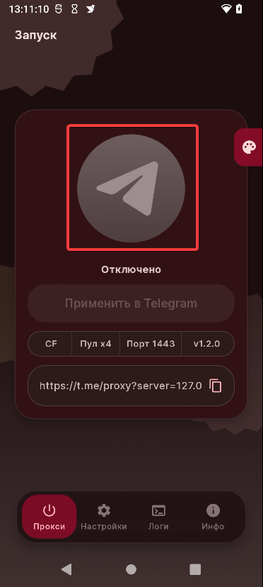
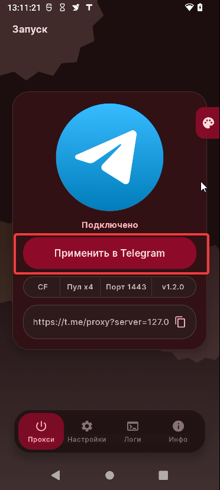
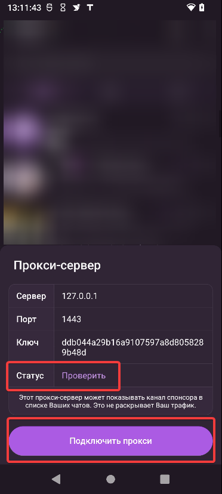
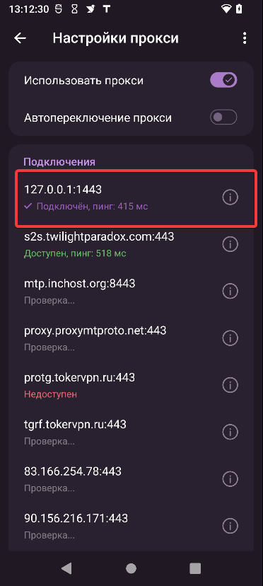
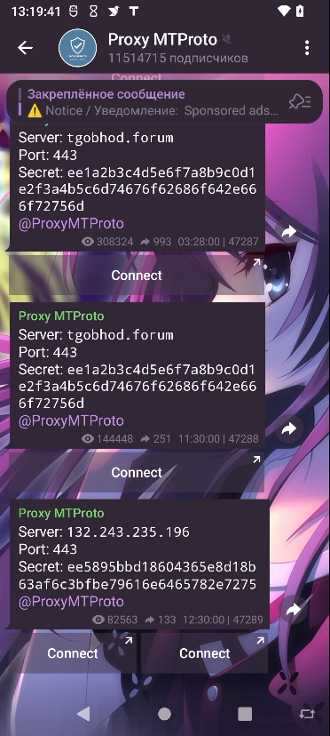
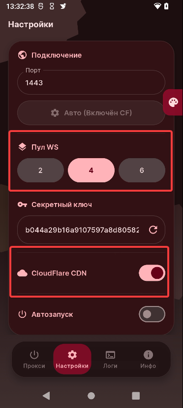

Приветик всем✌ На сегодня у нас будет решения для обхода блокировки исключительно для Телеграма. Это будет реализовано при использовании приложения, который создаёт локальный прокси.

Также оставлю ссылки, где можно найти прокси для ТГ, это если у вас приложение не будет работать должным образом или по иным обстоятельствам.

Ещё имеется [видео-инструкция по установке и использованию **TG WS Proxy Android**](https://www.youtube.com/watch?v=RP4RwyEHpwc&rco=1)

❗❗Если у вас не работает приложение, то советую внизу прочитать раздел "**Решения проблем**" Если после этого не получилось, то можно написать мне в Телеграме, чтобы там уже разобрались<3 (не даю гарантий) ❗❗

## Описание приложения (описание взято с Github'a автора)

**TG WS Proxy Android** — это локальный **MTProto-прокси** для Telegram на Android. Приложение помогает частично решать проблемы и в ряде сценариев ускоряет работу мессенджера, перенаправляя трафик через защищённые CloudFlare WebSocket-соединения или напрямую к датацентрам Telegram.

## Подготовка и установка

Скачиваем и устанавливаем наше приложение:

[**Github**](https://github.com/amurcanov/tg-ws-proxy-android/releases/tag/v1.2.0)

## Настройка и использование \ Запуск и проверка

Заходим в наше приложение и нажимаем на центральную кнопку

Затем, после включения, нажимаем на "**Применить в Telegram**", нас перебросит в ТГ

Подключаем прокси (по желанию можно проверить статус прокси-сервера, а точнее его пинг).

Ну вот и всё! В **настройках прокси** можем наблюдать такую картину:

## Прокси в ТГК!!!

Если вам не нравится пользоваться приложениями на подобии таких, то можно найти прокси в телеграм-каналах или в интернете. Один из самых популярных каналов про прокси является [**@ProxyMTProto**](t.me/ProxyMTProto)

Просто переходите по ссылке и там выбирайте любой из прокси (они часто публикуются)

>Нажимаем на "Connect" и подключаем прокси

## Решения проблем
Если у вас имеются проблемы с использованием приложения, то данный раздел может вам помочь ψ(._. )>

1. Возвращаемся в приложение и переходим во вкладку "**Настройки**"
 Затем изменяем значение "**Пул WG**" на любое другое значение и проверяем наш прокси. Если даже так не помогло, то пробуем выключить "**CloudFlare CDN**"" и также проверяем.

