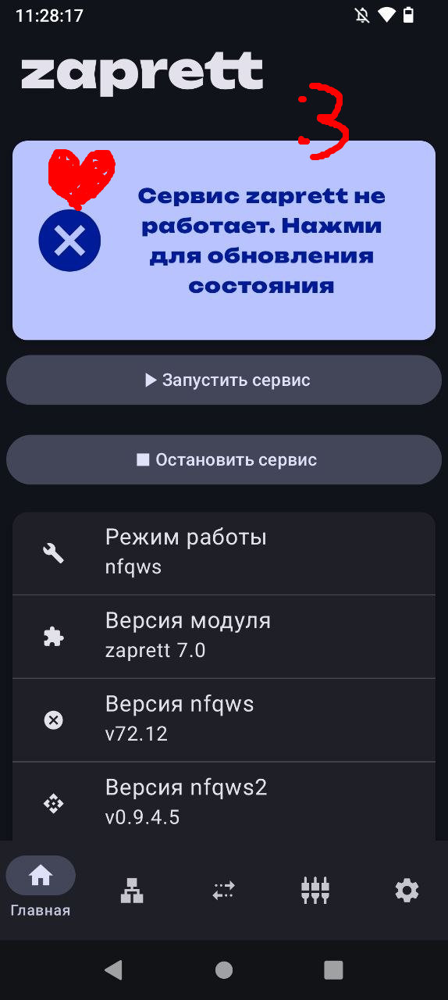
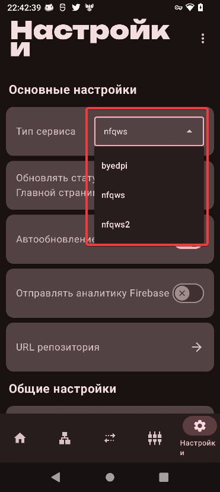
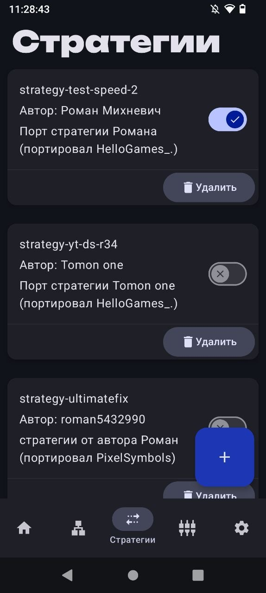

Всем приветик ;P Сегодня речь пойдет об Zapret, думаю очень многие его знают, но его в добавок сделали и для андроида. Способ не идеальный, более-менее работает с сайтами в браузере (。・ω・。)

## О приложении
Description is not found... So... that's it .-.

## Установка

Скачиваем и устанавливаем само [**приложение**](https://github.com/CherretGit/zaprett-app).

Для рут-пользователям нужно скачать [**модуль**](https://github.com/egor-white/zaprett)
и установить в ваш магиск.

После махинаций заходим в наше приложение   

Нас встречает такое приложение, тут мы можем увидеть версию byedpi, nfqws(2) и прочую муть.

## Настройка

Нам осталось только скачать саму стратегию и хост-лист

**НО сначало рут-юзерам нужно перейти в настройки (снизу иконка шестерни) и там в "тип сервиса" выбрать "nfqws" после предоставить рут-права приложению**

Переходим во вкладку "Стратегии", у вас будет пусто. Нажимаем на синий плюсик, затем "**скачать**", после чего появится окошко, где можно будет выбрать стратегию (для рут юзеров и обычных юзеров будут разные стратегии).

Установили стратегию и включили? Умнички (^人^) Теперь переходим во вкладку "Хосты" (слева от стратегий) и повторяем ту же процедуру.

## Запуск и проверка
И наконец... Возвращаемся во главную вкладку и включаем наш "обходник"

## Решение проблем и ответы на вопросы
Тут я распишу возможные решения, если приложение не хочет работать (*/ω＼*)

>У меня не работает программа. Что делать??
1. Изменить или выключить "Персональный DNS-сервер" (если не знаете как поменять, то смотрим в инете). Я могу посоветовать два dns'a: one.one.one.one или dns.google.

2. Сменить обход блокировок. Эта прога не идеальна, лучше выбрать тот же AmneziaVPN/WG

>Я могу добавить свои хост-листы или стратегии?

Ответ: Конечно! Можно найти текстовый .txt со всеми доменами мира и добавить его в приложение. Точно также со стратегией. Для этого во вкладке "стратегии" или "хосты" нажимаем на плюсик и "добавить" после этого ищем наш файлик в проводнике телефона.

>У меня во вкладках "Стратегии", "хосты" при нажатии "скачать" не отображаются стратегии/хосты для скачивания. Нам конец?

Ответ: Не думаю, что у вас будет такая проблема, но всё же опишу примерные варианты решения. Проверьте интернет соединение, если всё глухо, то ищем стратегии и хосты в интернете и добавляем их в приложение.

