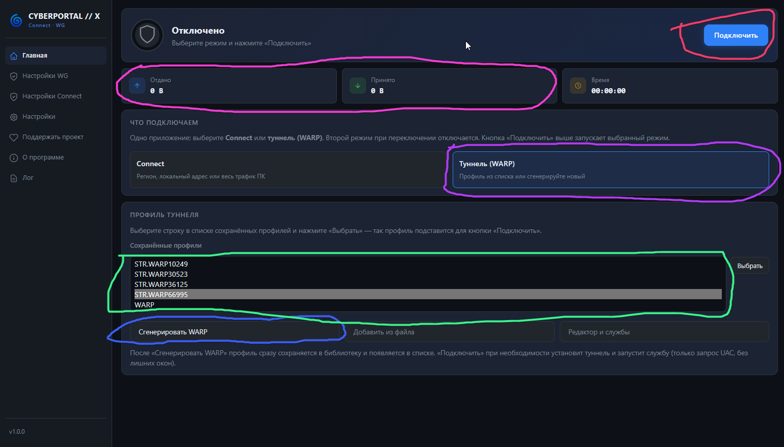
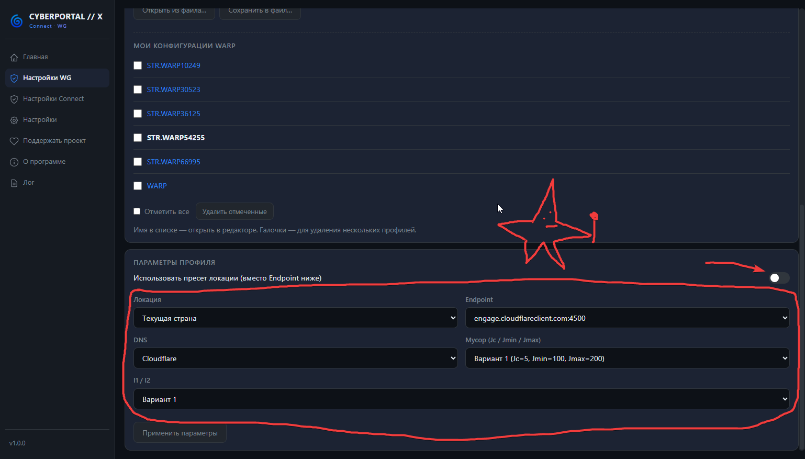

Всем приветик! ^^  
В этой инструкции у нас будет участвовать программа Cyberportal X

И ещё!!! У разработчика этой проги есть свой [ТГК](t.me/STR_BYPASS), где выходят обновления программ и где их удобно устанавливать!!!

### Что за CYBERPORTAL X?

**CYBERPORTAL X** — это удобный клиент на базе Portal WG + Connect + DPI-байпас. Всё в одной программе: обход блокировок, смена региона и WireGuard/WARP.

### 1. Установка
Скачиваем и устанавливаем программу с официальной страницы:  
[CYBERPORTAL X](https://sourceforge.net/projects/cyberportal/files/CYBERPORTAL%20X/)  
После установки просто запускаем прогу

#### 2. Использование
  

Принцип работы очень похож на мобильное приложение.

**Пошагово:**
1. Нажимаем кнопку **"сгенерировать WARP"**.
2. Выбераем созданный WARP в списке.
3. Нажимаем **"Подключить"**

Если WARP не подключается или после подключения интернет пропадает совсем — переходим к разделу с решением проблем.

### 3. Устранение проблем

> У меня не работает программа. WARP не подключается или после подключения ничего не работает. Что делать?

**Вариант 1 (самый простой):**  
Просто пару раз перезапустить WARP. Звучит как прикол, но часто помогает ^^

**Вариант 2:**  
WARP мог попасться "кривым". Можно просто подождать немного и создать новый WARP.

**Вариант 3 (настройки):**  
Переходим в **"Настройки Portal WG"**.

  

Тут можно попробовать поменять отмеченные параметры и нажать **"Применить параметры"**.  
У меня почему-то не применяются изменения (возможно баг), но у вас может получиться :P