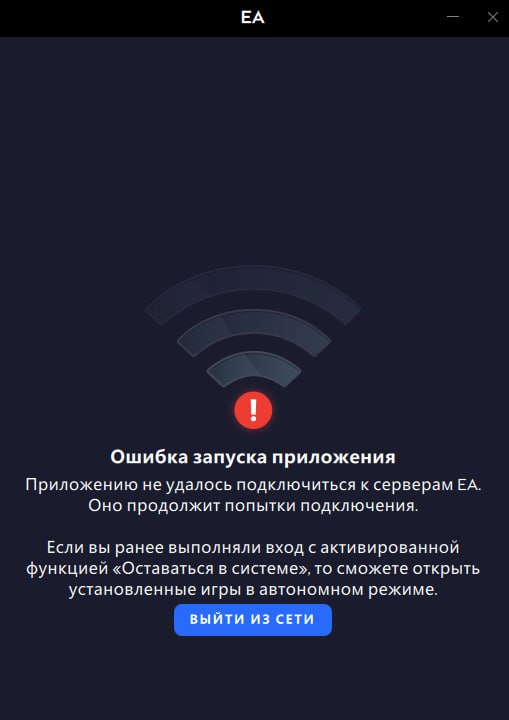
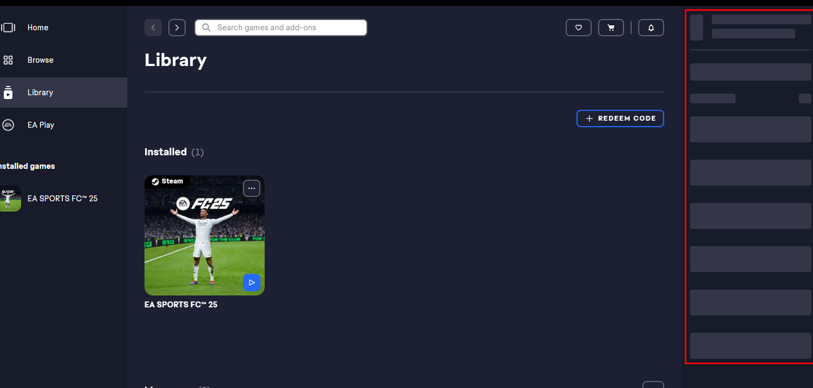
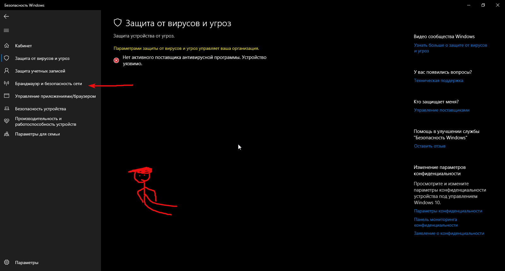
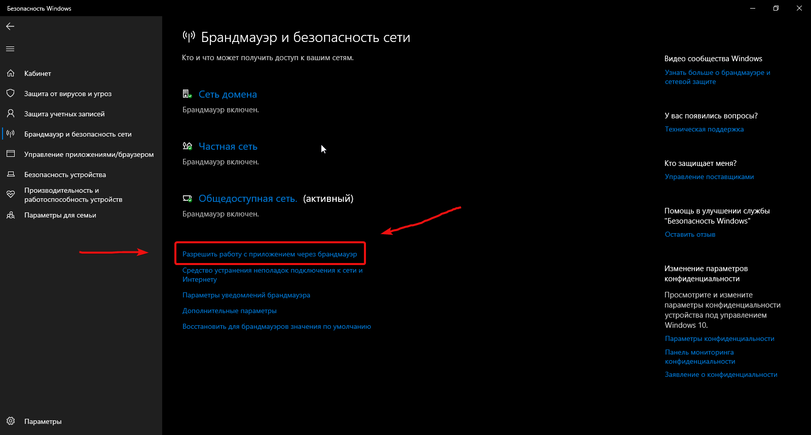
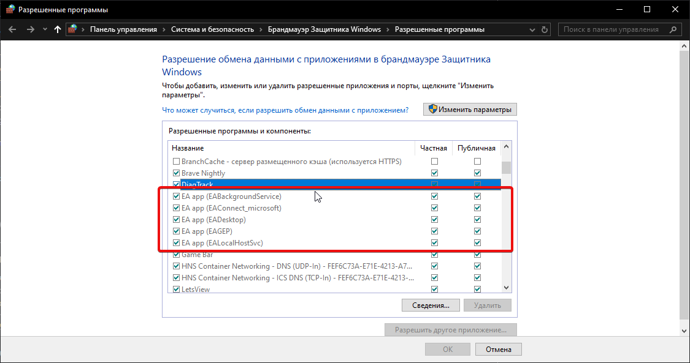

Всем привет! В общем, мне написал один человек в Тг, с просьбой помочь с... Я так понимаю, обходом блокировки серверов программы EA app, у него была ошибка с подключением к серверам. Ну я и стал искать по инету варианты решения проблемы. В конце концов я нашёл на Гитхабе обсуждения и выписал человеку варианты решения проблемы из этого обсуждения, и ему это помогло!! Потом он попросил меня написать "инструкцию". Вот поэтому вы это видите🤞

Сами обсуждения:
[Первое](https://github.com/Flowseal/zapret-discord-youtube/issues/5115)
[Второе](https://github.com/Flowseal/zapret-discord-youtube/discussions/3279#discussioncomment-14399628)

>Скриншот ошибки у человека

>А вот это у нас скриншот с обсуждения

## Варианты решения

## 1. Сначало предложу свой вариант, связанный с Zapret'om и файлом hosts

~~~
ea.com
origin.com
help.ea.com
verify.ea.com
signin.ea.com
cdn.ea.com
pin-river.data.ea.com
river-mobile.data.ea.com
service-aggregation-layer.juno.ea.com
desktop-config.juno.ea.com
spring18.gosredirector.ea.com
cdn.skum.eamobile.com
om.eamobile.com
synergy-stage.eamobile.com
a248.e.akamai.net
cdn.akamai.net
easo.ea.com
contentstorage.ema.ea.com
platform.turbine.ea.com
gateway.ea.com
accounts.ea.com
store.ea.com
socialintegration.ea.com
~~~

Данный список добавляем в Zapret

~~~
2.22.70.21 ea.com
2.22.70.21 api.ea.com
23.49.166.144 origin.com
23.200.147.183 eastore.com
2.22.106.108 help.ea.com
2.22.106.108 static.ea.com
2.22.106.108 support.ea.com
35.170.231.8 game.ea.com​
2.22.70.21  verify.ea.com
18.211.108.35 signin.ea.com
174.143.165.150 cdn.ea.com
35.175.8.170 pin-river.data.ea.com
54.85.101.0 river-mobile.data.ea.com
2.22.247.39  service-aggregation-layer.juno.ea.com
2.22.247.39 desktop-config.juno.ea.com
159.153.51.20 spring18.gosredirector.ea.com
2.19.117.15 cdn.skum.eamobile.com
63.140.39.214 om.eamobile.com
44.207.191.211 synergy-stage.eamobile.com
23.53.126.164 a248.e.akamai.net
23.53.126.164 cdn.akamai.net
159.153.71.17 easo.ea.com
159.153.71.17 contentstorage.ema.ea.com
159.153.71.17 platform.turbine.ea.com
2.22.70.21 gateway.ea.com
54.243.122.21 accounts.ea.com
2.22.70.21 store.ea.com
2.22.70.21 socialintegration.ea.com
~~~

Вот этот список добавляем в Hosts

[Что за домены? Zapret?](./ZAPRET_WINDOWS_LINUX.md) Там я расписал как установить Zapret и как добавить домена в Hosts :)

Если не помогло, то движемся дальше

## 2. Этот вариант я украл с первого обсуждения:

"Работает:
Домен(а) можно удалить в lists/list-general.txt
Если это игра или сервис, то можете попробовать выключить Game Filter в service.bat (требуется перезапуск обхода или переустановка сервиса)
Если не помогло выключение Game Filter, то можно найти IP и удалить из ipset-all.txt. Если не можете найти IP, то можно выключить фильтрацию по IP в service.bat (пункт Switch Ipset)

Не работает: пробуйте другие стратегии. Если не помогло, то:
Если это сайт, то добавьте домен в lists/list-general.txt (поддомены автоматически учитываются).
Если это игра, то попробуйте включить Game Filter и ipset в service.bat (требуется перезапуск обхода или переустановка сервиса). Если не помогло, то, возможно, IP не включён в список ipset-all.txt; в этом случае необходимо найти его самому и добавить ip/подсеть в упомянутый файл.

Пробуйте разные стратегии после внесения изменений в случае, если это не сработало"

[Что за Zapret?](./ZAPRET_WINDOWS_LINUX.md) Там я расписал как установить Zapret и как добавить домена :)

## 3. Ещё один способ, он более интересный (С второго обсуждения)

1. Нужно зайти в Защитник Виндовс (Windows defender)

2. Далее переходим в "Брандмаудэр и безопасность сети"

3. Нажимаем "Разрешить работу с приложением через брандмаудэр"

4. Снимаем галочки с EA app и перезапускаем программу. Всё должно сработать.

## 4. Более простой способ, необходим Zapret (первое обсуждение)

В обсуждении один из людей написал, что у него с конфигов "general (FAKE TLS AUTO).bat" Заработал EA app

[Что за Zapret?](./ZAPRET_WINDOWS_LINUX.md) Там я расписал как установить Zapret и как добавить домена :)

## Заключение

Какой итог? В теории какой-то из способ должен помочь. У меня Ea app без всего работает. И то что я написал... Я это проверить не могу, т.к у меня прога работает (^///^)

Пожалуюсь немного: Моё умение писать инструкции это ужас, я же всё это пишу саморучно, без нейросетей, я бывает могу застрять ненадолго и думать как то или иное написать... И от этого голова чуть тупит... Думаю я решу это

