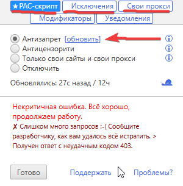

Всем приветик! В этом гайде я буду собирать расширения (Впн и прочее), которые работают.
Расширения будут для браузеров на хромиум. Для "экзатических" браузеров, на примере Фаерфокс тоже буду прикладывать ссылки, если такие будут.

Этот раздел будет меняться если расширения вдруг "умрут" или при иных ситуаций. Я не гарантирую работоспособность у всех, ну и не даю гарантии, что расширения не продают кому-то данные (Просто формальности, чтобы потом ко мне не прикапались с предъявами).

Можем начать!! =P

## 1 - Обход блокировок Рунета (прокси)
«Обход блокировок Рунета» (известный по расширению для браузеров и PAC-скриптам) — это умная система перенаправления трафика, которая использует прокси-серверы только для точечного доступа к запрещенным ресурсам. (Ответ от Gemini)

Вот буквально вчера попробовал его, он справляется вполне хорошо. Я отключил Zapret и проверил пару сайтов. Работает всё нормально, если работает, то добавляем в наш "список"

1 - Устанавливаем наше расширение.

[Расширение](https://chromewebstore.google.com/detail/%D0%BE%D0%B1%D1%85%D0%BE%D0%B4-%D0%B1%D0%BB%D0%BE%D0%BA%D0%B8%D1%80%D0%BE%D0%B2%D0%BE%D0%BA-%D1%80%D1%83%D0%BD%D0%B5%D1%82%D0%B0/npgcnondjocldhldegnakemclmfkngch) (Для хрома и ему подобных)

[Расширение](https://addons.mozilla.org/ru/firefox/addon/%D0%BE%D0%B1%D1%85%D0%BE%D0%B4-%D0%B1%D0%BB%D0%BE%D0%BA%D0%B8%D1%80%D0%BE%D0%B2%D0%BE%D0%BA-%D1%80%D1%83%D0%BD%D0%B5%D1%82%D0%B0/) (Для фаерфокс и ему подобных)

После установки и открытия расширения мы видим примерное такое:

 
Тут мы включаем "Антизапрет" ну и всё на этом для обычного использования.

Мелкие детали:

Отмечу, что тут можно свои сайты добавлять, но только через **вручную** добавленные вами прокси. Также... можно через tor браузер пошаманить, но я не буду всё это делать... Пока не нужно.

 
И ещё деталь от себя: Мне бывало попадались сайты с "геоблоком" (блокировка по айпи). Даже Запрет или hosts не помогали, потому что те не меняли айпи. Как раз данное расширение решает проблему.

## Bunny VPN
Это просто впн... Ничего такого, но он бесплатный и работает шустро (по крайней мере щас). Так что... Почему бы не добавить?

1 - Устанавливаем [расширение](https://chromewebstore.google.com/detail/bunny-vpn/lklimgabcbcgnpdmhcgeomcpigimjdfe) (К сожалению, но только для хромо-подобных)

Открываем и включаем. Всё ~_~ Можно даже премиум получить за подписку на ТГ создателей.

