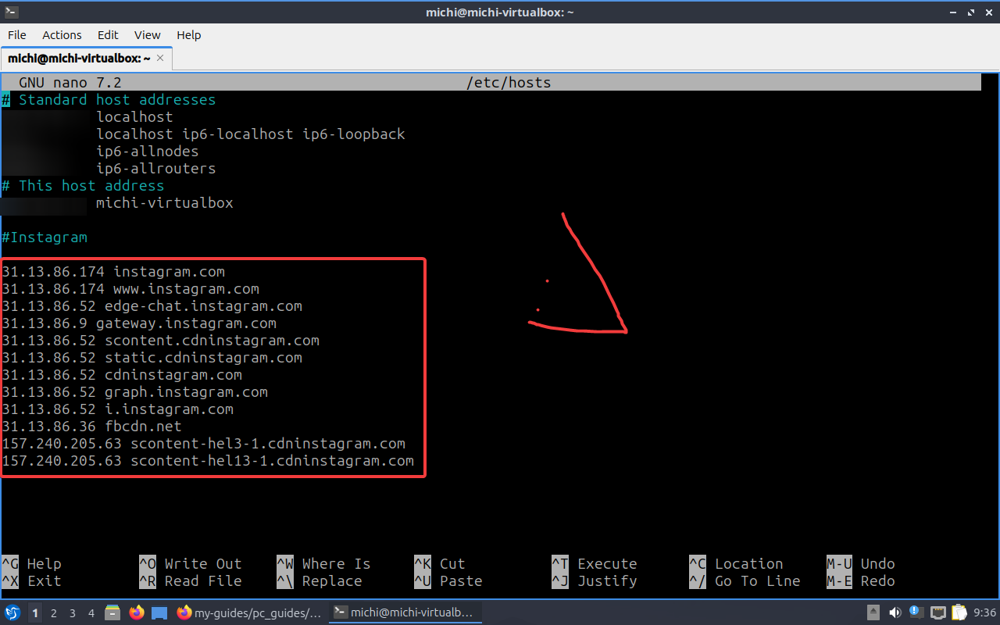

Приветик! Это простая инструкция по использованию файла HOSTS для Виндовс и Линукс

## 1: Редактирование файла Hosts (WINDOWS) 📝
Если нужно просто "направить" компьютер на правильную сторону (Во, как я круто написал)

Заходим в проводник и переходим по пути C:\Windows\System32\drivers\etc (или копируем сам путь и вставляем в проводнике). Мы наблюдаем файл "Hosts" Его открываем блокнотом или другим текстовым редактором **от имени администратора** и добавляем наши айпишки и домена по примеру из скриншота:

После чего сохраняем... И на этом всё!!!

## 1.1: Редактирование файла Hosts (LINUX) 📝

В терминале пишем **sudo nano /etc/hosts** (может отличаться команда) туда добавляем наши адреса. Сохраняем и выходим.

