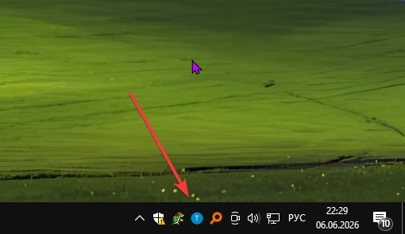
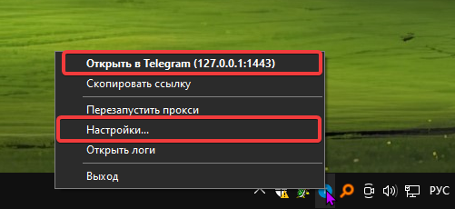
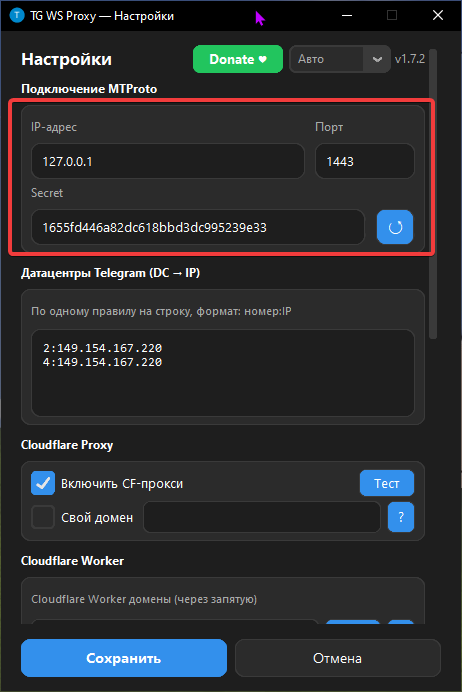
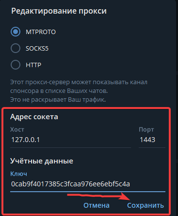

Всем приветик! Это простенькая инструкция. Здесь написано где скачать программу и как её "использовать". 

Уточню про Linux-юзеров: Я вам тут не расписал как нужно действовать, потому что... Ну не сильно желаю виртуалку качать и настраивать, поэтому просто оставлю ссылку на инструкция от самого создателя проги, также можете ориентироваться по инструкции, если действия будут похоже. Спасибо за понимание **<3**

## О программе (Описание с репозитория автора)

TG WS Proxy это локальный MTProto-прокси для Telegram Desktop, который ускоряет работу Telegram, перенаправляя трафик через WebSocket-соединения. Данные передаются в том же зашифрованном виде, а для работы не нужны сторонние серверы.

## Подготовка

Устанавливаем программу по этой [**ссылке**](https://github.com/Flowseal/tg-ws-proxy)

Для Linux пользователей эта программа тоже есть, узнать о том как установить можно также у автора в репозитории. Просто перейдите по [**ссылке**](https://github.com/Flowseal/tg-ws-proxy/blob/main/docs/README.linux.md) и установите из его инструкции

Мелкая справка: Там же в репозитории можно почитать подробнее о програмке, ну и узнать ответы на возможные вопросы

## Настройка/Использование

После скачивания exe файла просто переносим его на рабочий стол, либо куда вам удобнее будет и открываем его, для этого в трее находим иконку проги и кликаем по ней правой кнопкой мыши

Вот, я отметил два пункта, это "настройки" там можно будет настроить программу, и отметил "открыть в ТГ" по нажатию должен который должен перекидывать в ТГ

Если же не можете открыть через ТГ, то можно вручную это добавить. Заходим в "настройки" программы.

Я отметил, что нам нужно, это нужно для Телеграма. 

Открываем ТГ и переходим в: Настройки -> Продвинутые настройки -> Тип соединение. Ну и собственно мы попадаем в настройки прокси, после вручную пишем данные

Обязательно выбираем "MTPROTO", иначе никак, после сохраняем прокси и всё должно будет заработать

## Дополнительно

Программу можно добавить в автозапуск, для этого в настройках программы в самом внизу включаем автозапуск. (¬_¬ )

