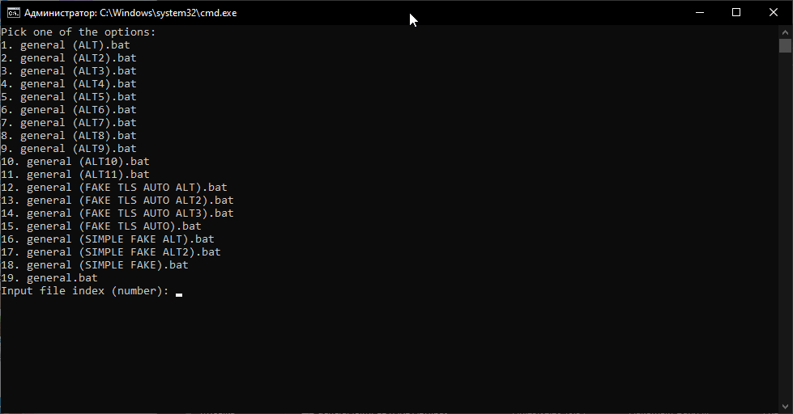
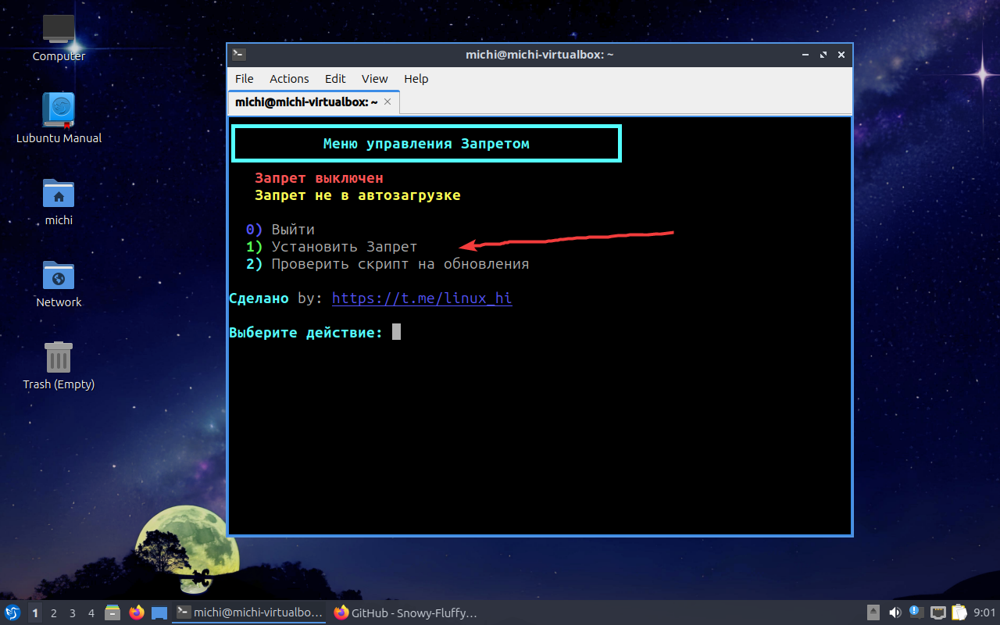
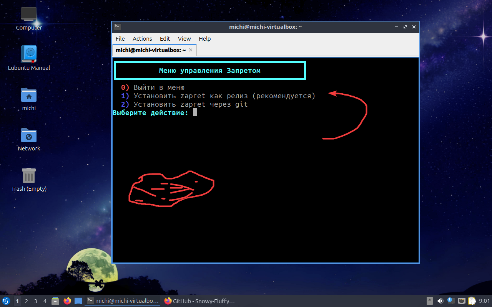
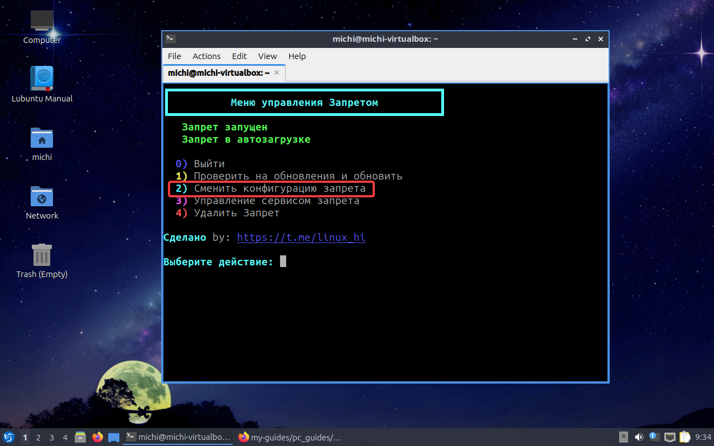
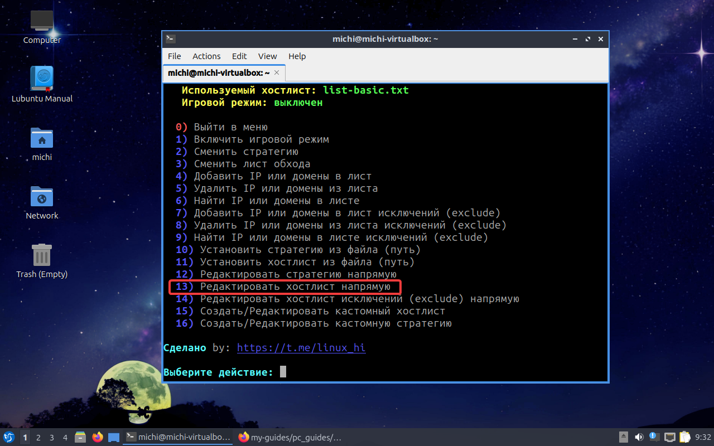

Тут собраны инструкции по установке и настройке Zapret'a для Виндовс и Линукс **<3**

## 1. Zapret (WINDOWS) ⚡

1. **Где взять:** [Скачиваем актуальную версию с GitHub](https://github.com/Flowseal/zapret-discord-youtube)
2. **Как настроить:** Создаём новую папку на рабочем столе, или где душа пожелает, после чего переносим содержимое архива в данную папку. 
Или если имеется "WinRAR" извлекаем архив вместе с папкой.

Далее в самом папке с Zapret'om открываем папку **"lists"**
И далее открываем текстовый документ **"list-general.txt"** и туда добавляем доменв как на скриншоте ниже

После мы сохраняем текстовый документ и возвращаемся в самое начало.
Выбираем из списка любую стратегию, они имеют расширение .bat

После чего у нас открывается коснсоль, её можно свернуть, **но не закрывать!!!** Т.к zapret перестанет работать!

Ну вот и всё!! После каждого запуска системы придётся запускать нащ .bat файл, но это можно автоматизировать. Переходим к следующему шагу

3. (Опционально) **Как автоматизировать запуск Zapret?**

В корневой папке открываем **service.bat** Там выбираем 1 - install services. Далее выбираем любую стратегию, которая вам приглянулась, у меня 11-ая.

После чего выходим из консоли. Теперь нам не нужно будет каждый раз запускать эту наглую стратегию ( •̀ ω •́ )✧

## 1.1: Zapret (LINUX) ⚡

Про моих линукс-юзеров я не забыл. Там не так много действий, так что справитесь!!!

**1. Установка:**

Скачать → [zapret.installer](https://github.com/Snowy-Fluffy/zapret.installer?tab=readme-ov-file) На сайте описана инструкция установки в виде одной команды.(Чтобы открыть запрет, пропишите в терминале "Zapret")

Устанавливайте Zapret выбирая пункты. Выбирайте: 1, 1 (Установить запрет, установить запрет как релиз)

Выбираем любую стратегию (к примеру ALT11) Если что всегда можно будет поменять

**2. Настройка запрета:**

Мы попадаем в главное меню запрета. Нам нужно добавить свои домена. Для этого выбираем:
1) Сменить конфигурацию запрета -> 13) Редактировать хостлист напрямую.

После уже там мы добавляем домена и сохраняем. Чтобы сохранить делаем такие комбинации:
Ctrl + O, Enter, Ctrl + X.