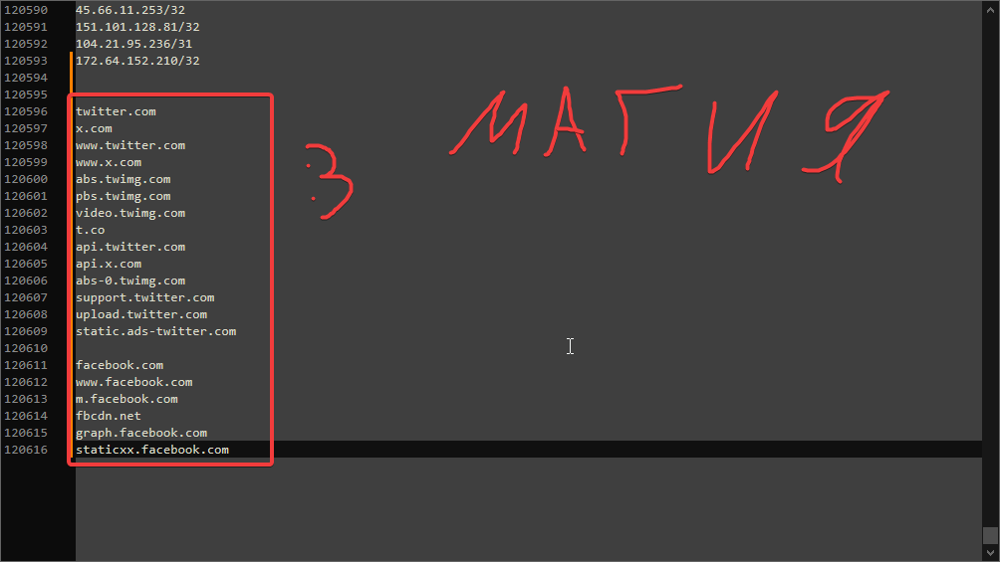
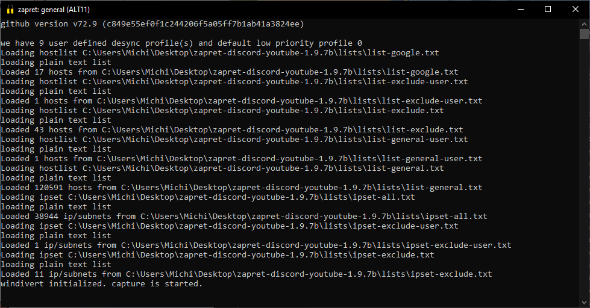
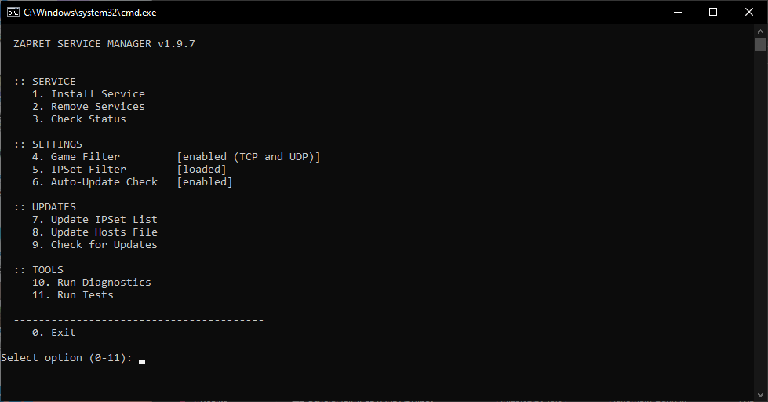
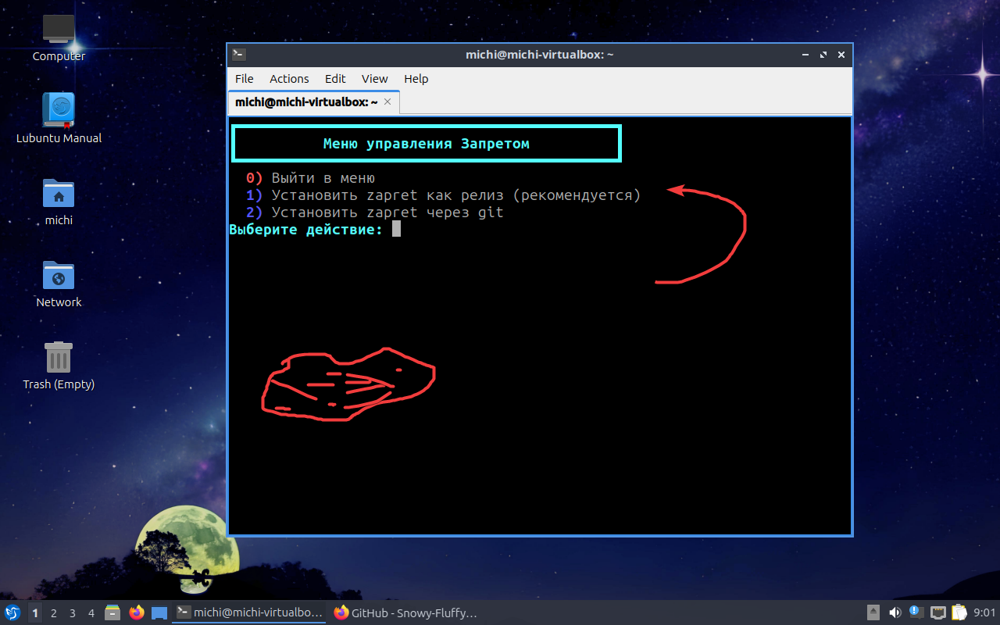

Всем приветик (‾◡◝) Тут написаны инструкции по установке и настройке Zapret'a для виндовс и линукс

## О программе
Что такое запрет? (Ответ от нейросети)

Zapret — это программный комплекс с открытым исходным кодом, предназначенный для обхода систем глубокого анализа трафика (DPI). В отличие от прокси-серверов или VPN, он не перенаправляет трафик через сторонние узлы, а модифицирует сетевые пакеты на уровне локального устройства или роутера.

Принцип работы:

Инструмент использует методы манипуляции TCP и HTTP протоколами, чтобы сделать запросы нечитаемыми для фильтров провайдера:

1. Фрагментация: разделение пакетов на мелкие части.

2. Изменение регистра: модификация заголовков (например, Host).

3. Добавление лишних данных: вставка "мусорных" байтов, которые игнорируются целевым сервером, но сбивают алгоритмы анализа DPI.

4. Манипуляция флагами: использование специфических параметров TCP-сессии.

Ключевые особенности:

1. Отсутствие серверов: работа происходит напрямую с целевым ресурсом, что сохраняет исходную скорость соединения.

2. Кроссплатформенность: поддержка Linux (включая OpenWrt для роутеров), FreeBSD и Windows.

3. Низкое потребление ресурсов: минимальная нагрузка на процессор и оперативную память.

  В самом низу инструкции есть раздел "**дополнительная информация**" Может быть там будет что-то полезное для вас (Проверьте хоть :Р)

## 1. Zapret (WINDOWS) ⚡

## Подготовка
**Где взять:** [Скачиваем актуальную версию с GitHub](https://github.com/Flowseal/zapret-discord-youtube)
**Как настроить:** Создаём новую папку на рабочем столе, или где душа пожелает, после чего переносим содержимое архива в данную папку.

## Настройка
Далее в самой папке с Zapret'om открываем папку **"lists"**
И далее открываем текстовый документ **"list-general.txt"** и туда добавляем домена как на скриншоте ниже

## Запуск и проверка
Сохраняем текстовый документ и возвращаемся в самое начало.
Выбираем из списка любую стратегию, они имеют расширение .bat

У нас открывается коснсоль, её можно свернуть, **но не закрывать!!!** Т.к zapret перестанет работать!

Ну вот и всё!! **Но!** после каждого запуска системы придётся запускать наш .bat файл, но это можно автоматизировать. Переходим к следующему разделу

## (Опционально) **Как автоматизировать запуск Zapret?**

В корневой папке открываем **service.bat** Там выбираем 1 - install services. Далее выбираем любую стратегию, которая вам приглянулась, у меня 11-ая.

После чего выходим из консоли. Теперь нам не нужно будет каждый раз запускать эту наглую стратегию ( •̀ ω •́ )✧

## 1.1: Zapret (LINUX) ⚡

Про моих линукс-юзеров я не забыл. Там не так много действий, так что справитесь!!!

## Подготовка

Скачиваем → [zapret.installer](https://github.com/Snowy-Fluffy/zapret.installer?tab=readme-ov-file) На сайте описана инструкция установки в виде одной команды.

Устанавливайте Zapret выбирая пункты, выбирая: 1, 1 (Установить запрет, установить запрет как релиз)

Выбираем любую стратегию (к примеру ALT11) Если что всегда можно будет поменять

## Настройка

Мы попадаем в главное меню запрета. Нам нужно добавить свои домена. Для этого выбираем:
1) Сменить конфигурацию запрета -> 13) Редактировать хостлист напрямую.

После уже там мы добавляем домена и сохраняем. Чтобы сохранить делаем такие комбинации:
Ctrl + O, Enter, Ctrl + X.

# Дополнительная информация

[**Видео-гайд по установке Zapret для виндовс**](https://www.youtube.com/watch?v=AHYo-L6m_7s&rco=1)

[**Видео-гайд по установке Zapret для линукс**](https://www.youtube.com/watch?v=sz7g4xrp3G0&rco=1)