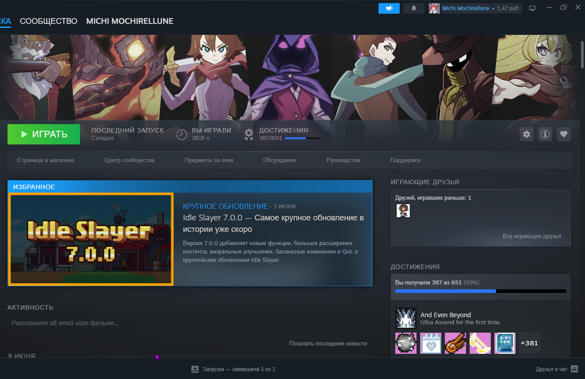

Всем приветик! Первое, хочу подтвердить, что я действительно играю в Idle Slayer, а то кто-нибудь подумает, что я вру, поэтому фото приложу ниже


>Моя статистика :3

## Как я обходил?

У меня игра не хотела сихронизироваться с облаком, тоесть в саму игру впускало, но предлагала играть в офлайн режиме. Я начал с нейронкой возиться, и мы смогли запустить сихронизацию с помощью создания отдельной стратегии Zapret

- Скриншоты проблем:


>Сама ошибка с неудачной сихронизацией


>Тут ошибка интересней, тут уже сихронизация хоть как-то, но проходит, но как и написано в причине: "Истекло время ожидания." и тоже прерывается.

Второй скриншот интересный, он проявляется когда я запускаю любую другую стратегию в Zapret, потому-что без стратегии будет первая ошибка. Это говорит нам о том что с стратегией сихронизация обходиться, но время ожидания истекает. Мне Gemini помог создать отдельную стратегию, которая вроде как уменьшает количество "спама" тем самым исправляется ошибка с "временем ожидания".

<details>
<summary> <b>Прикладываю слова нейросети, сразу скажу, что не гарантирую, что его слова верны, я сам в этом тютю полный</b></summary>
Починили ошибку «Время ожидания истекло»
Обычный обходчик слишком сильно спамит ложными пакетами, чтобы запутать блокировки. Сайтам нормально, а игра от такой задержки офигевает и обрывает связь. Мы снизили количество этого спама до минимума (repeats=2). Блокировка всё ещё путается, но данные долетают мгновенно, и облако успевает сохранить твой прогресс.

Научили понимать игровой язык
Обычные настройки ищут в сети только сайты. А у игр свой, «секретный» язык общения с серверами. Мы включили режим, которому плевать на тип трафика (any-protocol=1) — он маскирует и защищает от блокировок вообще всё, что запускает игра.

Сохранили идеальный пинг
Батник работает по принципу «обмани и отойди» (cutoff). Он путает блокировки только в первую секунду — когда игра заходит в сеть и проверяет твой аккаунт. Как только коннект пошёл, батник выключается и не лезет в процесс. В итоге пинг в игре остаётся идеальным.

Ничего не ломается вокруг
Этот файлик работает сам по себе и только на нужных игре портах (включая порт 443 для авторизации). Он не лезет в твои браузеры, Ютуб или Дискорд и ничего там не испортит.  
</details>

## Так как мне обойти?

Не знаю будет ли работать у вас или нет, но могу дать две мои стратегии, одна чисто под Idle Slayer, другая тоже, но с дополнительным правилом.

1. Скачиваем стратегии и кидаем их в Zapret

[**Первая стратегия**](https://drive.google.com/file/d/1RKVc01AvmDIRbar4DOrPtLU9vBz3UIS0/view?usp=sharing) и [**Вторая стратегия**](https://drive.google.com/file/d/1VtytYrocW54kcR2a5tGnl15sWD_8l-Bw/view?usp=sharing)

2. Запускаем стратегию и проверяем

Если после второго шага срабатывает, то это хорошо! Если нет, то следует другому шагу:

Если не сработало:
1. Добавляем в **list-general-user.txt**

```
pclead.co.uk
notelega.co.uk
idleslayer.com

kws203.pclead.co.uk
kws203.notelega.co.uk
```

И после снова проверяем :Р